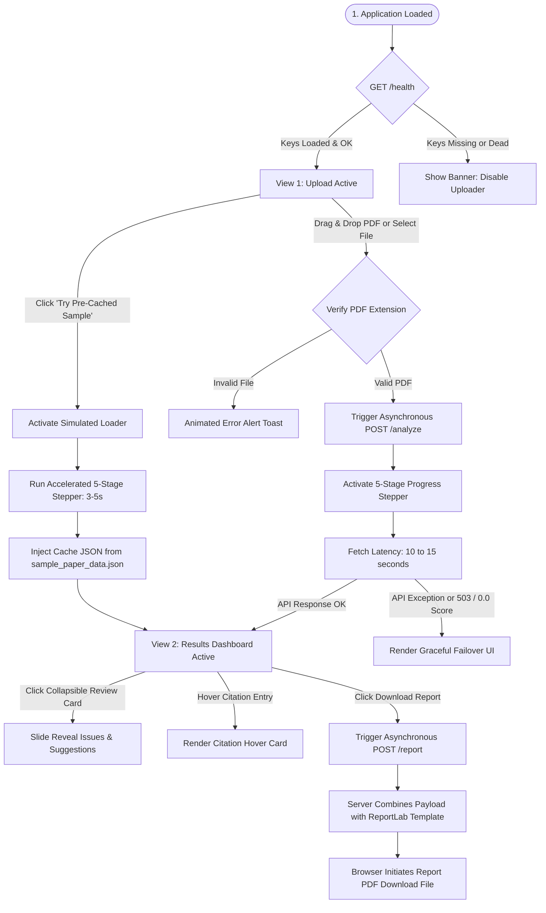

# RESEARCHSENSE: FULL FRONTEND INTEGRATION & ORCHESTRATION MANUAL

This manual is a comprehensive, production-grade guide designed for frontend developers integrating a custom web user interface with the **ResearchSense** backend. It details system architectures, REST API schemas, asynchronous client-side orchestration, dynamic UI states, and robust error-handling recipes.

---

## 1. System Architecture & Dev Setup

ResearchSense is built upon a stateless, fast, and secure API pipeline:
- **Backend Service:** A FastAPI python application running locally on `http://127.0.0.1:8000` (port is configurable). It performs heavy computational steps: PDF binary extraction, structural segmentation, Gemini LLM multi-layer grading, Semantic Scholar/CrossRef bibliography auditing, and ReportLab PDF compilation.
- **Frontend SPA:** A modern, single-page web dashboard communicating asynchronously with the backend via fetch requests.
- **CORS Support:** The FastAPI application is pre-configured with open CORS policies (`allow_origins=["*"]`). This guarantees that your custom frontend can be run from **any origin**—including VS Code's *Live Server* (`http://127.0.0.1:5500`), a custom bundler environment (Vite, Webpack), or even directly as a static file (`file:///C:/.../index.html`) in a browser window without triggering pre-flight blocks.

### Quick Start: Local Orchestration
To easily test and build against the backend:
1. Double-click **`Start_ResearchSense.bat`** in the root workspace. This batch file starts the FastAPI server in a background process, waits for the local port 8000 to bind, and automatically launches your configured web browser to point to the frontend index page.
2. When your session is finished, press any key in the batch console to gracefully terminate the background server process.

---

## 2. Interactive Application State Flow

Here is a visual breakdown of the single-page application's operational state transitions and data bindings:



---

## 3. Backend REST API Endpoints Specification

Your frontend JavaScript needs to orchestrate requests across three distinct endpoints.

### 3.1 Pre-Flight Diagnostics (`GET /health`)
- **Action Endpoint:** `GET http://127.0.0.1:8000/health`
- **When to Trigger:** Immediately on window load.
- **Description:** Verifies connection to the backend, queries the status of Gemini API keys, and checks CrossRef / Semantic Scholar connectivity.
- **Response Schema (`application/json`):**
```json
{
  "status": "healthy",
  "gemini": {
    "any_key_working": true,
    "gemini_keys_loaded": 3,
    "keys_status": [
      { "key": "Key_1", "status": "ok" },
      { "key": "Key_2", "status": "ok" },
      { "key": "Key_3", "status": "error: 403 Forbidden" }
    ],
    "model": "gemini-2.5-flash"
  },
  "crossref": { "status": "ok" },
  "semantic_scholar": { "status": "ok" }
}
```
- **Frontend Action Items:**
  1. Parse the response boolean `gemini.any_key_working`.
  2. If `true`, render a **Green Diagnostic Indicator Dot** in the header (`Status: Connected`).
  3. If `false`, render a **Red Diagnostic Indicator Dot**, disable the PDF dropzone, and overlay a warning banner instructing the user to supply valid Gemini API keys starting with `AIzaSy...` in their backend `.env` configuration file.

---

### 3.2 Paper Analysis Upload (`POST /analyze`)
- **Action Endpoint:** `POST http://127.0.0.1:8000/analyze`
- **When to Trigger:** Upon valid PDF drop/selection.
- **Request Type:** `multipart/form-data`
- **Payload:** File blob passed inside a single key named `file`.
- **Response Schema (`application/json`):**
```json
{
  "filename": "machine_learning_paper.pdf",
  "detected_sections": {
    "Abstract": 95,
    "Introduction": 90,
    "Methods": 88,
    "Results": 91,
    "Conclusion": 85,
    "References": 99
  },
  "section_count": 6,
  "warnings": ["discussion"],
  "layer_scores": {
    "structure_sections": 8.0,
    "clarity_writing": 7.5,
    "methodology_rigor": 6.5,
    "evidence_claims": 7.0,
    "citations": 6.0
  },
  "layer_details": {
    "structure_sections": {
      "score": 8.0,
      "issues": [
        "Abstract lacks a clear quantitative performance statement.",
        "Subsection 2.1 headings contain minor margins and formatting drift."
      ],
      "suggestions": [
        "Add core numerical results (e.g. accuracy rates) to the abstract.",
        "Standardize paragraph line margins in Subsection 2.1."
      ]
    },
    "clarity_writing": {
      "score": 7.5,
      "issues": [
        "Passive voice is overused in the methodology segment.",
        "Sentence length on Page 3 exceeds standard readability thresholds."
      ],
      "suggestions": [
        "Convert passive sentences to active voice for academic punchiness.",
        "Split compound sentences on Page 3 into two concise thoughts."
      ]
    },
    "methodology_rigor": {
      "score": 6.5,
      "issues": [
        "The datasets sample population size is not formally introduced.",
        "Control group parameters lack strict mathematical definition."
      ],
      "suggestions": [
        "Detail specific participant and dataset sample metrics.",
        "Add a mathematical formula describing control baseline bounds."
      ]
    },
    "evidence_claims": {
      "score": 7.0,
      "issues": [
        "Figure 3 lacks descriptive axis titles and scale indicators.",
        "Section 4 results do not fully substantiate accuracy claims."
      ],
      "suggestions": [
        "Label all figure axes clearly including dimensions and scale.",
        "Explicitly connect empirical findings back to core hypothesis claims."
      ]
    },
    "citations": {
      "score": 6.0,
      "issues": [
        "Detected 2 identical bibliographic entries (duplicates).",
        "3 citations do not contain searchable DOIs."
      ],
      "suggestions": [
        "Remove redundant duplicates in the bibliography.",
        "Locate and append DOIs for referenced items."
      ]
    }
  },
  "final_score": 71.0,
  "grade": "B — Good",
  "citation_result": {
    "total_refs": 10,
    "verified": 6,
    "not_found": 2,
    "unreachable": 2,
    "flagged_dois": ["10.1109/fake-doi-1"],
    "flagged_items": [
      {
        "citation": "Vaswani et al., 2017, Attention Is All You Need",
        "category": "duplicate",
        "detail": "Duplicate reference item located in bibliography array."
      }
    ]
  }
}
```

#### Important Core Restructuring Layer Key Mapping
When iterating through parameter metrics in the UI, bind the details using these **exact keys** returned inside the `layer_details` and `layer_scores` objects:
1. `structure_sections` (Structure & Sections)
2. `clarity_writing` (Clarity & Writing)
3. `methodology_rigor` (Methodology Rigor)
4. `evidence_claims` (Evidence & Claims)
5. `citations` (Citations & References)

---

### 3.3 Dynamic Report PDF Compiler (`POST /report`)
- **Action Endpoint:** `POST http://127.0.0.1:8000/report`
- **When to Trigger:** User clicks "Download PDF Report".
- **Request Type:** `application/json`
- **Payload:** The exact, unmodified JSON response object returned from the initial `/analyze` response payload. (This maintains stateless privacy; the backend compiles the ReportLab layout directly on-the-fly from the payload).
- **Response Format:** `application/pdf` binary stream.
- **JavaScript Consumer Flow:**
```javascript
async function downloadReportPdf(analysisPayload) {
    try {
        const response = await fetch('http://127.0.0.1:8000/report', {
            method: 'POST',
            headers: {
                'Content-Type': 'application/json'
            },
            body: JSON.stringify(analysisPayload)
        });
        
        if (!response.ok) throw new Error("Could not compile report PDF.");
        
        const pdfBlob = await response.blob();
        const downloadUrl = window.URL.createObjectURL(pdfBlob);
        
        // Dynamically create download anchor
        const downloadAnchor = document.createElement("a");
        downloadAnchor.href = downloadUrl;
        downloadAnchor.download = `${analysisPayload.filename.replace(".pdf", "")}_review_report.pdf`;
        document.body.appendChild(downloadAnchor);
        downloadAnchor.click();
        
        // Clean up memory
        document.body.removeChild(downloadAnchor);
        window.URL.revokeObjectURL(downloadUrl);
    } catch (err) {
        console.error("PDF Download Fail:", err);
        alert("Failed to download PDF report. Ensure backend server is responsive.");
    }
}
```

---

## 4. Front-End Component Development Blueprint

To build a dashboard that feels modern and premium, implement the following key UX modules:

### 4.1 High-Fidelity Drag-and-Drop Dropzone
- **UX Intent:** Zero friction upload interface. Provide distinct drag states.
- **States to Manage:**
  1. **Idle State:** Default uploader showing descriptive icons and a button.
  2. **Active Drag State:** Triggered on `dragover`. Overlay a subtle colored border pulse (e.g. cool glowing primary HSL) and blur background.
  3. **Rejection State:** When file drop is not a PDF, show a quick shake animation and alert message.
- **HTML Layout Strategy:**
```html
<div id="dropzone" class="dropzone-container">
    <input type="file" id="fileInput" accept=".pdf" style="display: none;" />
    <div class="dropzone-content">
        <svg class="icon-upload">...</svg>
        <h3>Drag & drop your research paper here</h3>
        <p>Supports PDF files up to 25MB</p>
        <button type="button" class="btn-primary" onclick="document.getElementById('fileInput').click()">Select File</button>
    </div>
</div>
```

---

### 4.2 Dynamic Multi-Stage Processing Stepper
- **UX Intent:** Analysis takes 10 to 15 seconds. Standard spinning loaders cause anxiety. Engender trust using a progressive 5-stage stepper displaying realistic milestones.
- **The 5 Stepper Milestones:**
  1. 📄 **Document Extraction** (*Extracting characters, fonts, and layouts...*)
  2. 🔍 **Academic Segmenter** (*Detecting headers & checking section presence...*)
  3. 🧠 **Multi-Layer AI Analysis** (*Gemini performing structured peer-review evaluations...*)
  4. 🔗 **Reference Verification** (*Querying CrossRef & Semantic Scholar citation data...*)
  5. 🏆 **Synthesizing Verdict** (*Compiling final grade card & generating feedback...*)
- **Implementation Strategy:** Use an interval timer. When a backend fetch starts, reveal the loader overlay and run a timer progressing through the steps:
  - **Stage 1:** Instant active (0.5s) -> complete (2.0s).
  - **Stage 2:** Active (2.0s) -> complete (4.0s).
  - **Stage 3:** Active (4.0s) -> complete (7.5s).
  - **Stage 4:** Active (7.5s) -> complete (10.0s).
  - **Stage 5:** Active (10.0s) -> wait for the active fetch call to finish before checking complete and fading out.
- **Visual Styles:** Pulse active stages with a bright, breathing glow (e.g., `box-shadow: 0 0 15px var(--accent-color)`). Completed stages render green checkmark icons.

---

### 4.3 Circular Progress Gauge (SVG)
- **UX Intent:** Render the `final_score` as a gorgeous circular gauge with dynamic numeric counters.
- **HTML structure:**
```html
<div class="gauge-wrapper">
    <svg class="gauge-svg" viewBox="0 0 200 200">
        <!-- Background Track -->
        <circle cx="100" cy="100" r="80" class="gauge-bg"></circle>
        <!-- Animated Active Indicator -->
        <circle cx="100" cy="100" r="80" class="gauge-fill" id="gaugeCircle"></circle>
    </svg>
    <div class="gauge-content">
        <span class="score-number" id="gaugeScore">0</span>
        <span class="score-max">/100</span>
    </div>
</div>
```
- **CSS Styling:**
```css
.gauge-bg {
    fill: none;
    stroke: rgba(255, 255, 255, 0.05);
    stroke-width: 12;
}
.gauge-fill {
    fill: none;
    stroke: var(--primary-glow-color);
    stroke-width: 14;
    stroke-linecap: round;
    stroke-dasharray: 502.6; /* 2 * PI * r (r=80) */
    stroke-dashoffset: 502.6; /* Starts empty */
    transform: rotate(-90deg);
    transform-origin: 100px 100px;
}
```
- **JavaScript Animator:**
```javascript
function animateGauge(finalScore) {
    const roundedScore = Math.round(finalScore);
    const circle = document.getElementById("gaugeCircle");
    const scoreVal = document.getElementById("gaugeScore");
    
    const circumference = 2 * Math.PI * 80; // 502.65
    const targetOffset = circumference * (1 - roundedScore / 100);
    
    // Smooth transition curve
    circle.style.transition = "stroke-dashoffset 1.8s cubic-bezier(0.1, 0.8, 0.2, 1)";
    circle.style.strokeDashoffset = targetOffset;
    
    // Numeric ticker counter
    let count = 0;
    const incrementDuration = 1800 / roundedScore; // match 1.8s
    const counterTimer = setInterval(() => {
        if (count >= roundedScore) {
            scoreVal.textContent = roundedScore;
            clearInterval(counterTimer);
        } else {
            count++;
            scoreVal.textContent = count;
        }
    }, incrementDuration);
}
```

---

### 4.4 Collapsible Layer Review Accordion
- **UX Intent:** Toggleable content cards for the 5 academic dimensions. Clicking a card header smoothly slides open lists of detailed Issues and Suggestions.
- **CSS Flex / Grid Trick for smooth slide transitions:**
```css
.accordion-content {
    display: grid;
    grid-template-rows: 0fr; /* Initial State is collapsed */
    transition: grid-template-rows 0.3s ease-out;
    overflow: hidden;
}
.accordion-content.expanded {
    grid-template-rows: 1fr; /* CSS Auto-height transition! */
}
.accordion-inner {
    min-height: 0px;
}
```
- **Data Rendering Guard:** 
  - Only fire expand/collapse actions when clicking the **card header element**.
  - Clicking buttons, copying list items, or selecting suggestions inside the expanded card tray must **not** trigger collapse. Use `e.stopPropagation()` on interactive elements inside the card body.

---

### 4.5 Academic Citations List with Rich Metadata Tooltips
- **UX Intent:** Map citation checks beautifully.
- **Layout Requirements:**
  - Separate verified bibliography items from duplicate warnings and invalid DOIs.
  - Flagged or duplicate DOIs must be positioned at the top of the bibliography dashboard panel with distinct red status badges: `[DUPLICATE REF]` or `[INVALID DOI]`.
  - Display verified reference citations in a grid.
- **Metadata Tooltip Trigger:**
  - Wrap verified citation items with a CSS tooltip anchor.
  - On hover or focus, render a metadata hover card displaying the publication details from CrossRef/Semantic Scholar:
```html
<div class="citation-entry tooltip-trigger">
    <span class="citation-index">[1]</span>
    <p class="citation-text">Vaswani et al., 2017, "Attention Is All You Need"</p>
    
    <!-- Dynamic Hover Tooltip Card -->
    <div class="tooltip-card">
        <h4>Paper Metadata</h4>
        <p><strong>Published:</strong> 2017 (NeurIPS)</p>
        <p><strong>Publisher:</strong> Advances in Neural Information Processing Systems</p>
        <p><strong>Database Citations:</strong> 132,492 citations</p>
    </div>
</div>
```

---

### 4.6 Offline / Demo Presentation Mode
- **UX Intent:** Gemini API keys are quota-limited. High-concurrency events (like classroom demos or academic presentations) easily run into transient `503 Service Unavailable` limits. Implement a pre-cached simulation mode that guarantees 100% demo uptime.
- **Mechanics:**
  - Place a text link: *"Try Pre-Cached Sample Paper"* right beneath the drop uploader zone.
  - Clicking the link triggers:
    1. A simulated loader overlay showing the 5-stage stepper (running at double-speed, lasting ~3.5 seconds total).
    2. Local injection of a pre-cached results JSON object structured exactly like the real API response (you can read this directly from a static JS variable or load `sample_paper_data.json` via a local fetch).
    3. Seamless transition into the dashboard view to display full metrics.
  - **Why this rules:** Allows your friend to demonstrate the UI beautifully even without internet access or valid Gemini keys!

---

## 5. JavaScript Integration Service Module

Here is a ready-to-use, production-tested JavaScript orchestration module. You can copy this directly into your JS files to manage endpoint communications:

```javascript
/**
 * ResearchSense API Client Service
 */
class ResearchSenseAPI {
    constructor(baseUrl = "http://127.0.0.1:8000") {
        this.baseUrl = baseUrl;
    }

    /**
     * Checks backend server status & API key diagnostics
     */
    async checkHealth() {
        try {
            const response = await fetch(`${this.baseUrl}/health`);
            if (!response.ok) throw new Error("Health check returned status " + response.status);
            return await response.json();
        } catch (error) {
            console.error("Health Check Connection Failed:", error);
            return { status: "offline", gemini: { any_key_working: false } };
        }
    }

    /**
     * Uploads paper PDF to backend for full layer analysis
     * @param {File} file - PDF File object
     * @returns {Promise<Object>} API JSON Payload
     */
    async analyzePaper(file) {
        const formData = new FormData();
        formData.append("file", file);

        const response = await fetch(`${this.baseUrl}/analyze`, {
            method: "POST",
            body: formData
        });

        if (!response.ok) {
            const errorDetails = await response.json().catch(() => ({}));
            throw new Error(errorDetails.detail?.message || "Analysis request failed.");
        }

        return await response.json();
    }
}
```

### 5.1 Graceful API Error & Fallback Management
During peak usage, the backend might return standard fallbacks if API limits are hit:
1. **Gemini Key Quota Exhausted (`503 / 429`):** The backend will return a valid analysis JSON structure, but the scores will fall back to `0.0` and the grade to `F — Very Poor` (representing Gemini query failure).
2. **Graceful UI Handling:** When the final score is `0.0`, display a gentle, friendly information box informing the user that Gemini is currently rate-limited on the free-tier quota, and offer them the button to trigger **"View Sample Demo Paper"** to explore the dashboard fully!

---

## 6. Premium UI Theme Design Tokens (HSL Theme)

Keep the UI fresh, modern, and aligned with cutting-edge academic SaaS applications. Apply these CSS custom properties to your global style definitions:

```css
:root {
    /* Palette Tokens - Premium Dark Slate Theme */
    --bg-primary: #0a0e17;        /* Clean dark navy base */
    --bg-secondary: #111827;      /* Elevating dashboard cards */
    --bg-elevated: #1f2937;       /* Dropdowns, tooltips, dialogs */
    
    --primary-glow: #3b82f6;      /* Cool clinical academic blue */
    --accent-glow: #8b5cf6;       /* Advanced AI purple highlight */
    
    /* Semantic Colors */
    --color-success: #10b981;     /* Used for Suggestions & high scores */
    --color-warning: #f59e0b;     /* Used for minor revisions */
    --color-danger: #ef4444;      /* Used for Issues & duplicate DOIs */
    --color-muted: #9ca3af;       /* Secondary paragraphs and footnotes */

    /* Typography */
    --font-heading: 'Outfit', sans-serif;
    --font-body: 'Inter', sans-serif;
    --font-mono: 'JetBrains Mono', monospace; /* Used for DOI indexes & JSON code keys */
}
```

Use simple transitions (`transition: all 0.2s cubic-bezier(0.4, 0, 0.2, 1)`) on all interactive buttons, card headers, and accordion rows to give the UI a responsive, premium tactile feel.

---

## 7. Developer Integration Checklist

Before declaring the integration complete, double-check that your frontend supports:
- [ ] **Pre-Flight Diagnostics:** Check the `/health` response status on window load and set status light indicator accordingly.
- [ ] **Valid File Guard:** Refuse non-PDF files on upload immediately.
- [ ] **Stateless PDF Generation:** Implement the `POST /report` handler passing the exact state JSON, enabling seamless downloads.
- [ ] **Simulated Offline Demo Mode:** Verify that the "Try Pre-Cached Sample Paper" loads results instantly with double-speed progress animations.
- [ ] **Failover Handling:** Gracefully catch network failure errors and API rate-limiting fallbacks (`final_score: 0.0`), suggesting the pre-cached demo to bypass issues.
- [ ] **Visual Theme & Variable Keys:** Ensure layer panels map precisely to the 5 keys (`structure_sections`, `clarity_writing`, `methodology_rigor`, `evidence_claims`, and `citations`).

---
**Happy coding! You are building a high-fidelity academic tool.** Let's deliver an outstanding dashboard experience!
