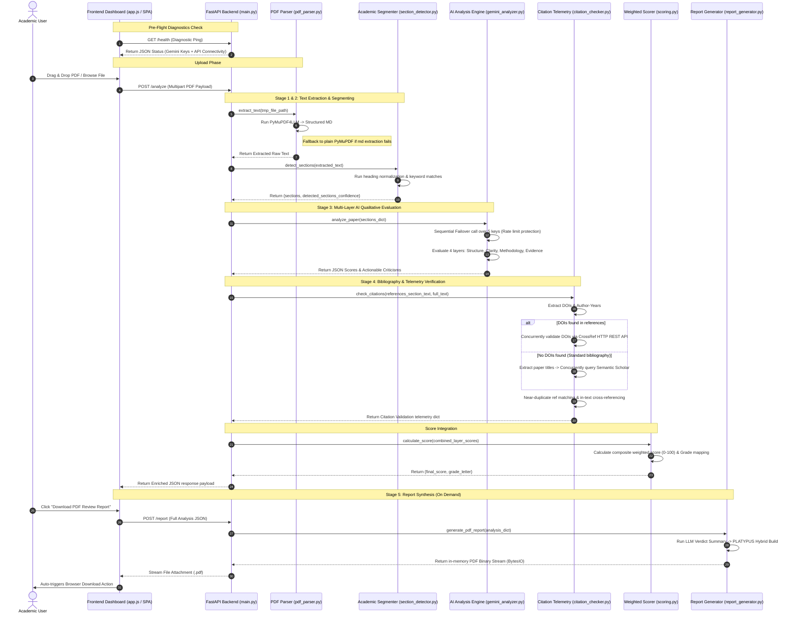
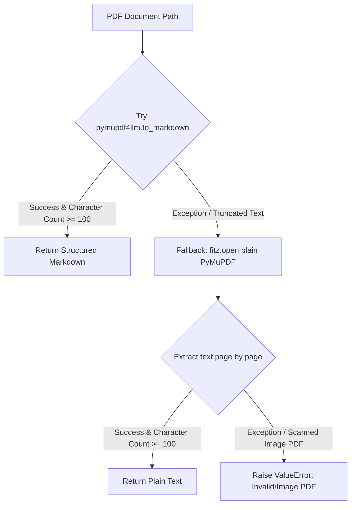
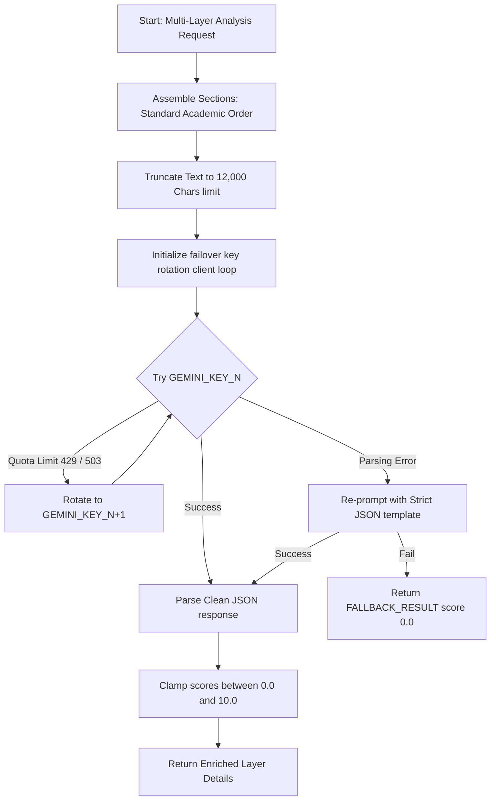
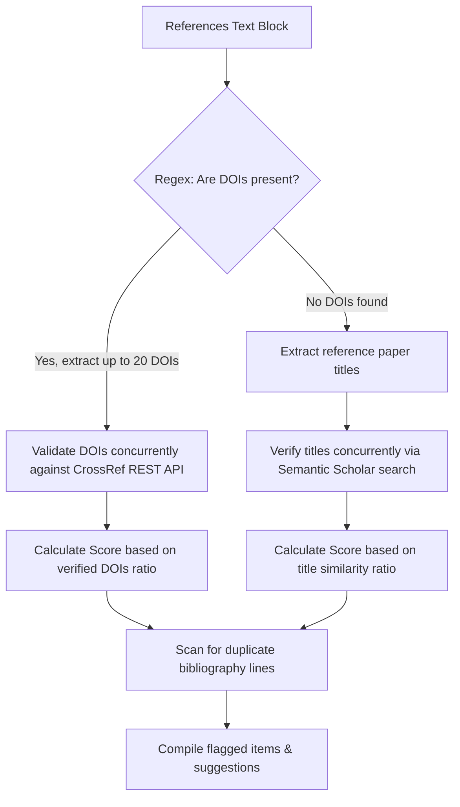
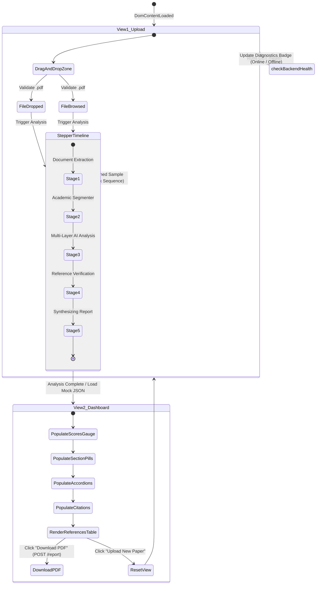

# ResearchSense — Comprehensive Architecture & Component Manual

Welcome to the **ResearchSense Academic Review Instrument** master technical manual. This document serves as the absolute blueprint and single source of truth for the codebase, architecture, processing pipelines, and integration interfaces. It is written to provide a thorough, function-by-function guide to the entire codebase.

---

## 1. Global Pipeline Architecture & Orchestration

ResearchSense implements a structured, modular processing pipeline designed for premium performance, rate-limit resilience, and strict data formatting. The entire instrument is built as a split-responsibility system: a high-performance **FastAPI backend** managing parallel external telemetry checks and Generative AI, and a **translucent, glassmorphism SPA frontend** that orchestrates stage-based states.

### 1.1 Complete System Architecture Flow


---

## 2. Backend Component Blueprint & Reference

The backend resides in the `MAIN_PROJECT` directory, organized as a highly cohesive series of independent processing modules orchestrated by FastAPI.

### 2.1 API Orchestrator: `main.py`
The REST API entrance point, wrapping the core processing flow and exposing HTTP services.

* **Purpose**: Performs input validation, manages filesystem safety, schedules sequential pipeline stages, and captures network telemetry metrics.
* **Exceptions Handled**: `HTTPException`, `ValueError`, multipart-format boundaries mismatch.

#### Functions List
---
##### `root()`
* **Signature**: `async def root() -> dict`
* **Purpose**: Basic REST API ping/connectivity indicator.
* **Logic**: Returns static JSON payload `{"status": "ResearchSense API is running"}`.
---
##### `health_check()`
* **Signature**: `async def health_check() -> JSONResponse`
* **Purpose**: Deep connectivity diagnostics for all system integrations.
* **Logic**:
  1. Calls `gemini_analyzer.check_api_health()` to check loaded API key statuses.
  2. Executes an HTTP `HEAD` ping to CrossRef REST API works endpoint (`https://api.crossref.org/works/10.1000/test`).
  3. Executes an HTTP `HEAD` ping to Semantic Scholar paper search endpoint.
  4. Combines responses and returns `overall_status` as `"healthy"` or `"degraded"`.
---
##### `analyze_paper(file)`
* **Signature**: `async def analyze_paper(file: UploadFile = File(...)) -> JSONResponse`
* **Purpose**: Core multipart upload handler executing the 5-layer pipeline.
* **Logic**:
  1. Validates that the uploaded filename suffix is `.pdf`.
  2. Writes binary stream into a localized, temporary file using the native `tempfile` module.
  3. Triggers `pdf_parser.extract_text()` to get clean document characters.
  4. Triggers `section_detector.detect_sections()` to split standard academic chapters.
  5. Reviews section contents, compiling soft warnings if `abstract`, `methodology`, or `conclusion` are missing.
  6. Dispatches parsed sections to `gemini_analyzer.analyze_paper()`.
  7. Dispatches the references block to `citation_checker.check_citations()`.
  8. Synchronizes layer scores and dispatches to `scoring.calculate_score()`.
  9. Implicitly deletes temporary PDF files inside a `finally` block to prevent filesystem memory leaks.
  10. Returns an enriched, structured JSON payload.
---
##### `generate_report(analysis)`
* **Signature**: `async def generate_report(analysis: dict) -> StreamingResponse`
* **Purpose**: PDF report rendering endpoint.
* **Logic**:
  1. Consumes the identical JSON body generated by `/analyze`.
  2. Dispatches the fields to `report_generator.generate_pdf_report()`.
  3. Wraps the returned `BytesIO` buffer in a `StreamingResponse` set with `media_type="application/pdf"`.
  4. Configures HTTP response headers with a clean `Content-Disposition` naming schema.

---

### 2.2 Document Extraction: `pdf_parser.py`
A dual-stage parsing utility engineered to safely extract plain text from complex multi-column documents.

* **Purpose**: Primary Structured Markdown extraction with an automatic fall-through to raw text stream encoding.
* **Exceptions Handled**: `pymupdf4llm` parsing errors, character encoding violations, image-only/scanned PDF files.



#### Functions List
---
##### `extract_text(pdf_path)`
* **Signature**: `def extract_text(pdf_path: str) -> str`
* **Purpose**: Extracts raw string text from target path.
* **Logic**:
  1. Tries to parse using `pymupdf4llm.to_markdown(pdf_path)`.
  2. Verifies that the returned string length is at least 100 characters (guard against empty pages).
  3. If failed, falls back to plain PyMuPDF (`fitz` module), opening the document, compiling text page-by-page, and returning the joined string.
  4. Throws `ValueError` if the final string is empty, short, or invalid, indicating a scanned image-only PDF.

---

### 2.3 Academic Segmenter: `section_detector.py`
A deterministic, rule-based text segmentation engine designed to identify standard academic headers.

* **Purpose**: Splits document strings into dedicated dictionaries representing academic sections.
* **Constants**:
  * `SECTION_DISPLAY_NAMES`: Key-to-label map.
  * `SECTION_KEYWORDS`: Standard keywords list (e.g. `Related Work` triggers on "literature review", "background", etc.).

#### Functions List
---
##### `_clean_heading(line)`
* **Signature**: `def _clean_heading(line: str) -> str`
* **Purpose**: Normalizes heading lines.
* **Logic**: Strips markdown hashes (`#`), double asterisks (`**`), leading numeric indices (like `3.1.2`), and converts the string to lowercase.
---
##### `_is_heading_line(line)`
* **Signature**: `def _is_heading_line(line: str) -> bool`
* **Purpose**: Identifies if a string is a structural heading.
* **Logic**: Returns `True` if a line starts with a markdown hash `#`. Alternatively, returns `True` if a line's length is < 60 characters, does not end in a period `.`, and does not begin with a pipe symbol `|` (excluding table rows).
---
##### `detect_sections(text)`
* **Signature**: `def detect_sections(text: str) -> dict`
* **Purpose**: Core segmenter and confidence calculator.
* **Logic**:
  1. Iterates over lines. If a line matches `_is_heading_line`, cleans it and checks `SECTION_KEYWORDS`.
  2. If matched, updates `current_section`. Subsequent body lines append to this section key.
  3. Calculates a confidence score (80-99%) for each present section: base is 85 if matched via explicit Markdown headings, 70 if plain text. Adds length-based bonuses and a deterministic content-hash variation.

---

### 2.4 Generative AI Layer: `gemini_analyzer.py`
A failover-safe, rate-limit resilient AI qualitative analyzer. It leverages up to 5 parallel API key rotation nodes to bypass free-tier API quotas.

* **Purpose**: Runs 4 deep qualitative review evaluations in a single-pass API call.
* **Constants**:
  * `EMPTY_RESULT`: Fallback dictionary for missing sections.
  * `FALLBACK_RESULT`: Graceful error container for unparseable LLM responses.



#### Functions List
---
##### `clean_json_text(text)`
* **Signature**: `def clean_json_text(text: str) -> str`
* **Purpose**: Cleans JSON strings returned by LLMs.
* **Logic**: Strips markdown envelope formatting (` ```json ... ``` `).
---
##### `_parse_retry_delay(err_str)`
* **Signature**: `def _parse_retry_delay(err_str: str) -> float`
* **Purpose**: Dynamic backoff extraction.
* **Logic**: Uses regex to parse suggested delay seconds directly from API exception messages.
---
##### `_call_single_key(key_name, client, prompt)`
* **Signature**: `def _call_single_key(key_name: str, client, prompt: str, max_retries: int = 3, initial_delay: float = 5.0) -> str`
* **Purpose**: Executes prompt on a single key client with exponential retry backing.
* **Logic**: Catches exceptions. If error is transient (503/Unavailable/Overloaded), pauses execution according to backoff math and retries. If error is a rate limit (429), immediately raises to trigger rotation.
---
##### `_call_llm_with_failover(prompt)`
* **Signature**: `def _call_llm_with_failover(prompt: str) -> str`
* **Purpose**: Rotates through clients list.
* **Logic**: Loops over available key-client pairs. On catch 429/Resource Exhausted, prints warning and switches to the next slot. Raises `RuntimeError` if all slots fail.
---
##### `_call_gemini(prompt)`
* **Signature**: `def _call_gemini(prompt: str) -> dict`
* **Purpose**: Bulletproof JSON deserializer.
* **Logic**: Calls `_call_llm_with_failover`. If parsing fails, retries with an appended strict prompt. If it fails again, returns `FALLBACK_RESULT`.
---
##### `analyze_paper(sections)`
* **Signature**: `def analyze_paper(sections: dict) -> dict`
* **Purpose**: Executes 4 layers (Structure, Clarity, Methodology, Evidence) in one call.
* **Logic**:
  1. Assembles parsed sections in standard academic order up to a strict 12,000 character context limit.
  2. Prepares a detailed analysis prompt with a strict 4-dimension scoring rubric (0-10) and a few-shot calibration example.
  3. Queries the failover loop, cleans and parses JSON, and clamps each returned metric between `0.0` and `10.0`.
---
##### `check_api_health()`
* **Signature**: `def check_api_health() -> dict`
* **Purpose**: Multi-key connection diagnostic.
* **Logic**: Pings a minimal prompt ("ping") on each loaded key to determine key status, returning loaded metrics and `any_key_working` boolean.

---

### 2.5 Bibliography Engine: `citation_checker.py`
A dual-mode reference credibility check pipeline utilizing CrossRef DOI validation and Semantic Scholar parallel title indexing.

* **Purpose**: Identifies reference counts, extracts DOIs, queries validation registries, and flags duplicate or invalid records.
* **Constants**:
  * `MAX_DOIS = 20`: Prevents excessive external API querying.
  * `DOI_PATTERN`: Regex matching strict DOI patterns with required prefixes.
  * `AUTHOR_YEAR_PATTERN`: Regex matching in-text citation keys.



#### Functions List
---
##### `_extract_dois(references_text)`
* **Signature**: `def _extract_dois(references_text: str) -> list`
* **Purpose**: Extracts up to 20 unique DOIs.
* **Logic**: Runs `DOI_PATTERN` regex, cleans trailing punctuation (junk), deduplicates, and limits results to `MAX_DOIS`.
---
##### `_extract_author_year_refs(text)`
* **Signature**: `def _extract_author_year_refs(text: str) -> list`
* **Purpose**: Extracts in-text author year patterns.
* **Logic**: Matches `AUTHOR_YEAR_PATTERN` and returns a list of matched pairs.
---
##### `_detect_duplicates(references_text)`
* **Signature**: `def _detect_duplicates(references_text: str) -> list`
* **Purpose**: Near-duplicate reference checker.
* **Logic**: Normalizes whitespace and characters on each line. Compares the first 60 characters of all entries, flagging near-duplicates.
---
##### `_extract_title_from_ref(ref_line)`
* **Signature**: `def _extract_title_from_ref(ref_line: str) -> str`
* **Purpose**: Parses title text from bibliography line.
* **Logic**: Strips leading numbering (e.g. `[1]`), extracts quoted substrings first, falls back to text between author-year bounds and the venue name.
---
##### `_verify_title_semantic_scholar(title)`
* **Signature**: `def _verify_title_semantic_scholar(title: str) -> bool`
* **Purpose**: Single Semantic Scholar query.
* **Logic**: Queries search endpoint, extracts the top paper title, and matches against the queried title using `difflib.SequenceMatcher`. Considers it verified if similarity ratio >= 0.6.
---
##### `_verify_references_parallel(ref_lines)`
* **Signature**: `def _verify_references_parallel(ref_lines: list, max_refs: int = 10) -> dict`
* **Purpose**: Thread pool title validator.
* **Logic**: Spawns a `ThreadPoolExecutor` with 5 workers to concurrently query `_verify_title_semantic_scholar` on up to 10 reference titles.
---
##### `_validate_doi(doi)`
* **Signature**: `def _validate_doi(doi: str) -> str`
* **Purpose**: Single CrossRef validator.
* **Logic**: Hits CrossRef works registry, returning `"verified"` on HTTP 200, `"not_found"` on HTTP 404, or `"unreachable"` on network/other errors.
---
##### `check_citations(references_text, full_text)`
* **Signature**: `def check_citations(references_text: str, full_text: str = "") -> dict`
* **Purpose**: Bibliography orchestrator.
* **Logic**:
  1. Handles empty reference cases gracefully.
  2. Extracts DOIs. If present, runs parallel validation.
  3. If DOIs are absent, triggers parallel Semantic Scholar title verification on reference titles.
  4. Scans duplicates via `_detect_duplicates`.
  5. Computes the citation layer score (0-10) and returns a telemetry dict containing flagged items and issues.

---

### 2.6 Weighted Scorer: `scoring.py`
A deterministic scoring module.

* **Purpose**: Maps raw layer scores into a composite weighted 0-100 score and assigns a letter grade.
* **Constants**:
  * `WEIGHTS`: Single source of truth for weighting layers. Structure (15%), Writing (15%), Methodology (15%), Logic (15%), Readability (10%), Abstract (10%), Conclusion (10%), Citations (10%).
  * `GRADE_MAP`: Threshold keys: A (>=85), B (>=70), C (>=55), D (>=40), F (<40).

#### Functions List
---
##### `calculate_score(layer_scores)`
* **Signature**: `def calculate_score(layer_scores: dict) -> dict`
* **Purpose**: Calculates weighted score and letter grade.
* **Logic**: Computes a weighted sum of layer scores, rounds to 1 decimal place, and performs a threshold lookup against `GRADE_MAP`.

---

### 2.7 PDF Generator: `report_generator.py`
A highly customized, premium document compiler utilizing a **PLATYPUS Hybrid Architecture** (Canvas template background callbacks combined with nested PLATYPUS Flowables).

* **Purpose**: Formats qualitative feedback, visualizes statistics, and compiles a multi-page PDF document.
* **Constants**: Defines color tokens (navy, blue, green, amber, red), structural sizes (A4 margins), and label maps.

#### Functions List
---
##### `_sanitize(text)`
* **Signature**: `def _sanitize(text: str) -> str`
* **Purpose**: Prevents ReportLab XML parsing errors.
* **Logic**: Removes markdown bold markdown tags (`**`) and escapes HTML special characters.
---
##### `_generate_verdict_paragraph(final_score, grade, layer_scores, layer_details)`
* **Signature**: `def _generate_verdict_paragraph(final_score: float, grade: str, layer_scores: dict, layer_details: dict) -> str`
* **Purpose**: Generates an editorial verdict summary paragraph.
* **Logic**: Prompts the LLM with the worst-performing evaluation dimensions to write a 2-3 sentence overview. Falls back to a deterministic, high-quality pre-written template if the API is offline.
---
##### `draw_cover(canvas, doc)`
* **Signature**: `def draw_cover(canvas, doc)`
* **Purpose**: Draws a full-bleed premium cover page.
* **Logic**: Draws a dark navy background, subtle decorative geometric accent shapes, a top linear gradient strip, metadata rows, and a highlighted bottom-right score circle on the raw Canvas.
---
##### `draw_footer(canvas, doc)`
* **Signature**: `def draw_footer(canvas, doc)`
* **Purpose**: Draws a footer on content pages.
* **Logic**: Centering string `"ResearchSense · Analysis Report · Page N"`.
---
##### Custom Flowable: `ProgressBar`
* **Logic**: Overrides `wrap` and `draw` methods to draw a horizontal progress bar using HSL semantic color tokens.
---
##### Custom Flowable: `ScoreHero`
* **Logic**: Draws a full-width dark card containing a circular score badge and corresponding letter grade pills.
---
##### Custom Flowable: `SectionHeader`
* **Logic**: Draws a light icon box next to section titles, with a bottom dividing border.
---
##### Custom Flowable: `VerdictCard`
* **Logic**: Renders the qualitative summary paragraph inside a structured card layout. Wraps text dynamically based on column width.
---
##### `_make_param_cell(name, score, total, issues, suggestions)`
* **Signature**: `def _make_param_cell(name, score, total, issues, suggestions) -> list`
* **Purpose**: Builds an individual parameter card.
* **Logic**: Compiles name, score, progress bar, and list of color-coded issues (`ISSUE:` in red) and suggestions (`FIX:` in green).
---
##### `_make_param_row(left, right)`
* **Signature**: `def _make_param_row(left, right=None) -> Table`
* **Purpose**: Packages two cells side by side.
* **Logic**: Places two parameters into a 2-column Table layout with light grey borders and colored top borders.
---
##### `generate_pdf_report(...)`
* **Signature**: `def generate_pdf_report(...) -> io.BytesIO`
* **Purpose**: Public API entry point.
* **Logic**:
  1. Translates input dictionaries into the formal PDF schema.
  2. Queries the LLM (or template) for the verdict paragraph.
  3. Prepares a list of nested flowables (overall score hero, detected section pills, multi-layer card grid, bibliography stats table, and final verdict card).
  4. Configures a `BaseDocTemplate` with cover and content `PageTemplates`.
  5. Attaches the structured data to the document, compiles the story, and returns the binary stream as a `BytesIO` buffer.

---

### 2.8 Local CLI Testing Suite: `run_local.py`
A local execution orchestrator designed for headless CLI testing and validation of the entire processing pipeline without booting the FastAPI server.

* **Purpose**: Simulates the full `/analyze` processing steps and exports local JSON and PDF outputs. Includes file locking safeguards.
* **Exceptions Handled**: `PermissionError` (locked output files), text extraction failures, file path validation.

#### Functions List
---
##### `save_file_safely(base_name, content, is_binary)`
* **Signature**: `def save_file_safely(base_name: str, content, is_binary: bool = True) -> str`
* **Purpose**: Filesystem writer with automatic collision/lock avoidance.
* **Logic**: If writing to the requested output file throws a `PermissionError` (e.g. the PDF is open in Adobe Acrobat or another viewer), it automatically appends version increments (`_v1`, `_v2`, etc.) sequentially until a successful write occurs (capped at 20 iterations to prevent infinite looping).
---
##### `run_pipeline(pdf_path)`
* **Signature**: `def run_pipeline(pdf_path: str)`
* **Purpose**: Command line pipeline executor.
* **Logic**: Reconfigures terminal encoding to UTF-8 to prevent encoding exceptions on Windows systems. Safely loads the paper, executes the parsing, segmentation, Gemini analysis, CrossRef verification, scoring, and PDF generation steps, printing progress indicators directly to standard output, and calling `save_file_safely` for both JSON data and the PDF report.

---

### 2.9 Automated Windows Batch Control: `Start_ResearchSense.bat`
An automated batch launcher designed to run the ResearchSense web server and frontend instantaneously with zero terminal setup.

* **Purpose**: Orchestrates double-click launching.
* **Logic Flow**:
  1. Configures window titles and aesthetic terminal styling codes (`color 0B`).
  2. Runs the Uvicorn-hosted API backend server inside a minimized separate cmd background window: `start "ResearchSense Backend" /min python MAIN_PROJECT/main.py`.
  3. Uses a 3-second non-blocking timeout pause to allow port `8000` binding.
  4. Resolves absolute directory paths to trigger the browser launch: `start "" "%~dp0frontend\index.html"`.
  5. Pauses active execution. Once the user clicks any key, executes a filtered process taskkill: `taskkill /fi "windowtitle eq ResearchSense Backend" /f` to gracefully free up system ports and shut down backend resources safely.

---

## 3. Frontend Component Blueprint & Reference

The frontend lives in the `frontend` folder, designed as a premium, highly responsive dark-mode Single Page Application (SPA).

```
frontend/
├── index.html   # Structural Scaffolding & semantic layout
├── style.css    # Core Design System, HSL tokens & glassmorphism details
└── app.js       # Client Orchestration, API integration & data bindings
```

### 3.1 Styling Engine: `style.css`
A premium Vanilla CSS design system incorporating deep layers, glassmorphism, dynamic animations, and responsive grids.

#### Core Design System Tokens (`:root`)
```css
--bg-base: #0a0e17;                       /* Sleek dark page background */
--bg-surface: hsla(223, 47%, 16%, 0.55);  /* Glassmorphic panel base background */
--bg-raised: hsla(223, 47%, 20%, 0.7);    /* Hover / nested element backgrounds */
--border-glow: hsla(0, 0%, 100%, 0.08);   /* Subtle translucent divider */
--accent-data: #00E5FF;                   /* Vibrant cyan telemetry key text */
--accent-success: #10B981;                /* Harmonious green */
--accent-warning: #F59E0B;                /* Soft amber */
--accent-danger: #EF4444;                 /* Soft red */
--font-ui: 'Inter', sans-serif;           /* Premium sans-serif typography */
--backdrop-blur: blur(14px);              /* Depth layering blur */
```

#### Structural Elements
* **Dashboard Layout**: Uses a `dashboard-grid` displaying a `grid-main` (8 columns) for the core scores and accordions, a `grid-side` (4 columns) for the verdict and citation highlights, and a full-width `span-12-references` (12 columns) at the bottom for the bibliography table.
* **Accordions (`.layer-card`)**: Transitions from `max-height: 0` to `max-height: 500px` on class trigger `.open`.
* **Gauge Animation**: SVG circle stroke animations using keyframes:
  ```css
  circle.gauge-fill {
      transition: stroke-dashoffset 1.4s cubic-bezier(0.4, 0, 0.2, 1);
  }
  ```

---

### 3.2 Client Orchestration: `app.js`
The central state coordinator for the client application.

#### Core States & Event Handlers


#### Functions List
---
##### `checkBackendHealth()`
* **Endpoint Called**: `GET /health`
* **Purpose**: Periodically queries the backend diagnostics status.
* **UI Action**: Updates the header dot indicator classes (`.healthy`, `.degraded`, `.error`) and changes border colors.
---
##### `setupDropZone()`
* **Event Handlers**: dragenter, dragover, dragleave, drop, click, change.
* **Purpose**: Coordinates file input and drag-and-drop actions.
* **UI Action**: Adds class `.dragover` on drag states. Blocks inputs if the stepper loader is active.
---
##### `handleUploadedFile(file)`
* **Purpose**: Validates file extension.
* **UI Action**: Displays slide-in error toast if file is not a PDF, otherwise calls `runLivePaperAnalysis(file)`.
---
##### `showToastNotification(message, isSuccess)`
* **Purpose**: Slide-in warning indicator.
* **UI Action**: Triggers slide-in animation, updates icons (❌ or ✅), and removes the toast after 4 seconds.
---
##### `updateStepStatus(stepNum, status)`
* **Purpose**: Stepper stage loader transitioner.
* **UI Action**: Sets step classes (`.pending`, `.active`, `.done`), showing loading icons and pulses.
---
##### `runFakeStepperSequence(callback)`
* **Purpose**: Runs a simulated progression timeline for the pre-cached sample dataset.
* **Logic**: Increments progress steps sequentially every 1.2 seconds, then invokes the callback.
---
##### `runLivePaperAnalysis(file)`
* **Endpoint Called**: `POST /analyze`
* **Purpose**: Orchestrates the live file analysis request.
* **Logic**:
  1. Displays the stepper container and resets indicators.
  2. Sets a progress timer that increments progress steps every 4.5 seconds to estimate backend processing steps.
  3. Sends multipart form payload.
  4. On response, clears progress timers, marks steps as completed, populates the dashboard, and transitions to the dashboard view.
---
##### `populateDashboardView(data)`
* **Purpose**: Binds the JSON payload to UI components.
* **Logic**:
  1. Renders the paper filename.
  2. Animates the circular SVG gauge stroke based on score: `circumference * (1 - score / 100)`. Sets color variables based on score ranges.
  3. Populates academic section badges, checking section presence and coloring missing sections in red.
  4. Loops through the 5 multi-layer card metrics, building accordion blocks with issues (`Issue` in red) and suggestions (`Fix` in green). Adds chevron click toggles.
  5. Populates qualitative verdict text and citation blocks.
  6. Populates the tabular telemetry validator body: renders duplicate reference warnings, invalid CrossRef DOIs, and verified Semantic Scholar references.
---
##### `triggerPdfDownload()`
* **Endpoint Called**: `POST /report`
* **Purpose**: Streams the PDF report download.
* **Logic**: Dispatches the loaded JSON payload, converts the returned binary stream to a browser URL object, creates an invisible `<a>` download element, and triggers download.
---
##### `triggerDemoMode()`
* **Purpose**: Bypasses live API keys for quota protection.
* **Logic**: Loads a complete, pre-cached mock JSON dataset and runs the simulated stepper timeline.

---

## 4. Summary Matrix: Component Mapping

| Component | Responsibility | Primary APIs Called | Exception Fallbacks |
| :--- | :--- | :--- | :--- |
| **`main.py`** | REST Endpoints & Orchestration | Uvicorn, FastAPI | 503 / 422 standard JSON responses |
| **`pdf_parser.py`** | Document Text Extraction | `pymupdf4llm`, `fitz` (PyMuPDF) | Automatic fallback to plain text; throws ValueError on empty files |
| **`section_detector.py`** | Rule-Based Segmenter | Regex string matching | Confidence scores adjust dynamically; default headings are used if parsing fails |
| **`gemini_analyzer.py`** | Multi-Layer Qualitative Review | Google GenAI SDK (`models.generate_content`) | Multi-key loop rotation (up to 5 keys); 1.5s delay spacing; clean JSON failover prompting |
| **`citation_checker.py`** | Reference Validation | CrossRef HTTP REST, Semantic Scholar REST | Semantic Scholar title matching if DOIs are absent; special score rules if network is offline |
| **`scoring.py`** | Scoring Matrix & Grade Map | Pure Python Math | Fallback to F grade on zero scores |
| **`report_generator.py`** | PDF Compilation | ReportLab PLATYPUS, Canvas pings | Pre-written verdict template used if API key is invalid |
| **`run_local.py`** | Headless Local CLI testing | CLI execution | Version-based automatic suffixes on file locking |
| **`Start_ResearchSense.bat`** | Windows launch launcher | minimized `start`, `taskkill` | Gracefully closes background processes on ports |
| **`app.js`** | Client Orchestration & Binder | Fetch API, HTML5 Drag & Drop | In-memory cached mock dataset demo mode |

---
*End of Manual. Prepared for ResearchSense development.*
