# ResearchSense — Diagram Prompts & Mermaid Schemas

This document compiles structured diagram descriptions, text-to-image prompts (for Midjourney/DALL-E), and copy-paste **Mermaid.js** code blocks for all main modules and workflow components of the ResearchSense project. You can copy these directly into other AI agents or diagram tools.

---

## Table of Contents

1. [Global System Architecture](#1-global-system-architecture)
2. [End-to-End Analysis Workflow](#2-end-to-end-analysis-workflow)
3. [main.py — FastAPI Orchestrator](#3-mainpy--fastapi-orchestrator)
4. [pdf_parser.py — Document Text Extraction](#4-pdf_parserpy--document-text-extraction)
5. [section_detector.py — Two-Tier Structural Parser](#5-section_detectorpy--two-tier-structural-parser)
6. [text_compressor.py — Text & Prompt Compression](#6-text_compressorpy--text--prompt-compression)
7. [gemini_analyzer.py — AI Evaluation & Key Rotation](#7-gemini_analyzerpy--ai-evaluation--key-rotation)
8. [scoring.py — Adaptive Scoring Matrix](#8-scoringpy--adaptive-scoring-matrix)
9. [citation_checker.py — Reference Telemetry & Validation](#9-citation_checkerpy--reference-telemetry--validation)
10. [report_generator.py — ReportLab PDF Engine](#10-report_generatorpy--reportlab-pdf-engine)
11. [app.js — Frontend SPA State Controller](#11-appjs--frontend-spa-state-controller)
12. [electron/main.js — Desktop Process Bootloader](#12-electronmainjs--desktop-process-bootloader)

---

## 1. Global System Architecture

* **Diagram Type:** High-level component flowchart
* **AI Image Gen Prompt:** 
  > A clean, modern enterprise software architecture diagram. Flat 2D vector style, minimal blue and dark slate grey color palette. Shows three distinct layers side-by-side: Client UI (Browser and Electron wrappers), Backend API Service (FastAPI), and External Services (Google Gemini API, CrossRef REST API, Semantic Scholar API, and ArXiv Atom API). Labeled boxes with connecting directional arrows showing JSON data paths. Clean typography, high contrast, professional, sans-serif, transparent background.
* **Mermaid Code:**
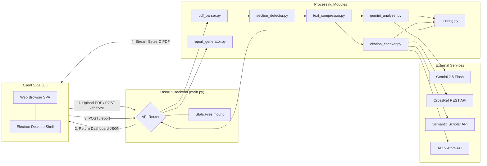

---

## 2. End-to-End Analysis Workflow

* **Diagram Type:** Sequence Diagram
* **AI Image Gen Prompt:**
  > A professional sequence diagram showing end-to-end message flows for a file analysis application. 2D vector illustration with a dark blue and teal theme. Vertical swimlanes representing User, Browser UI, FastAPI Backend, PDF Parser, Gemini LLM, and External Citation APIs. Labeled messages with arrows flowing down sequentially from Step 1 (Upload) to final PDF report download. Clear, crisp text, modern UI style.
* **Mermaid Code:**
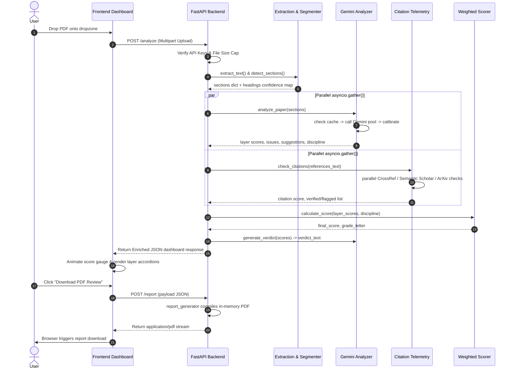

---

## 3. main.py — FastAPI Orchestrator

* **Diagram Type:** Flowchart TD
* **AI Image Gen Prompt:**
  > A software routing and flow diagram. Labeled boxes showing FastAPI endpoint logic. Shows entry routes like /health, /analyze, /report, and static mounts. Illustrates check_api_health check guards, size checks, parallel execution paths, and error fallbacks. Teal accents, clean flow lines, transparent background.
* **Mermaid Code:**
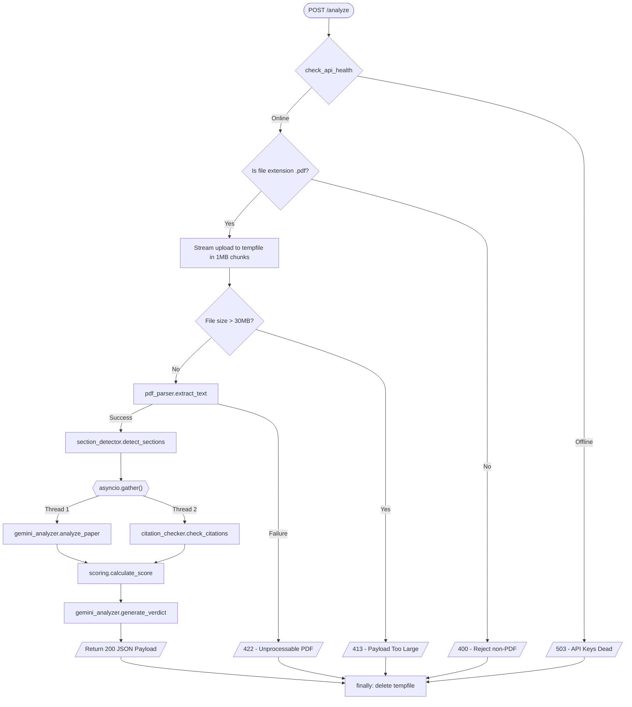

---

## 4. pdf_parser.py — Document Text Extraction

* **Diagram Type:** Fallback flowchart
* **AI Image Gen Prompt:**
  > A dual-path software logic flowchart. Clean blue and gray blocks. Left path shows primary parser utilizing pymupdf4llm to convert PDF to Markdown. Center shows check box for character length. Right path shows fallback strategy using fitz plain PyMuPDF text reader with reading-order sorting. Minimalist tech look.
* **Mermaid Code:**
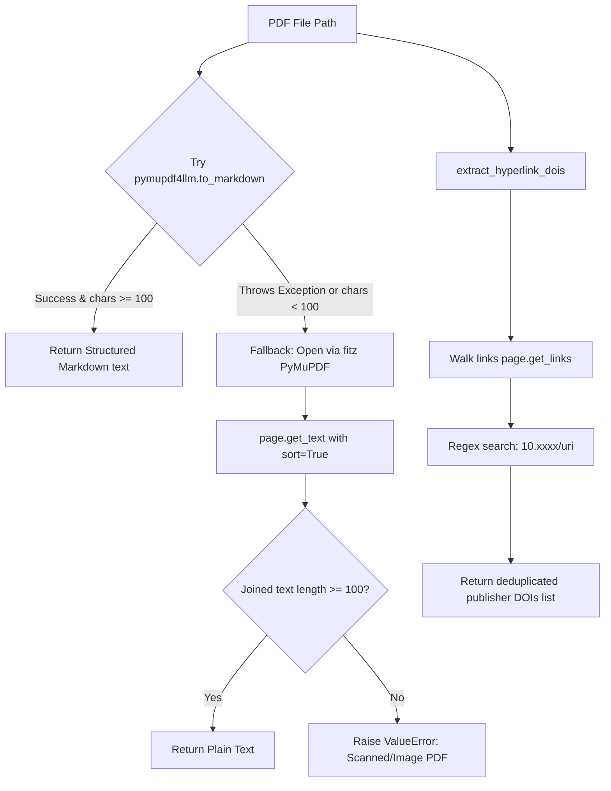

---

## 5. section_detector.py — Two-Tier Structural Parser

* **Diagram Type:** Processing flowchart
* **AI Image Gen Prompt:**
  > A flowchart displaying heading segmentation in documents. Tier 1 shows regex keyword matching scan. Decision diamond labeled "Fewer than 4 sections detected?". Yes path leads to Tier 2 LLM heading mapper querying Gemini. No path goes straight to confidence calculation. Slate grey background, professional engineering design.
* **Mermaid Code:**
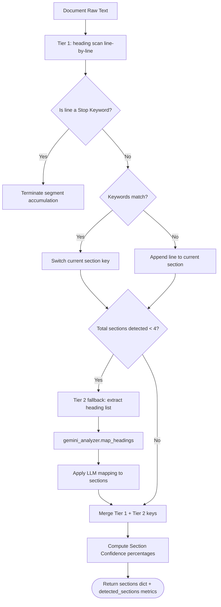

---

## 6. text_compressor.py — Text & Prompt Compression

* **Diagram Type:** Linear pipeline
* **AI Image Gen Prompt:**
  > A sequential pipeline diagram showing data compression stages. A text document shrinks as it moves through Stages: Whitespace Cleanup, Citations Stripping, Boilerplate Sentence Removal, and Mathematical Formula removal. Shows methodology section bypassed with a green shield icon. Modern flat 2D style.
* **Mermaid Code:**
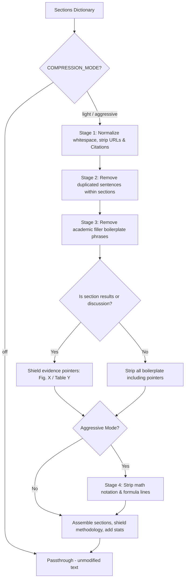

---

## 7. gemini_analyzer.py — AI Evaluation & Key Rotation

* **Diagram Type:** Orchestration flowchart
* **AI Image Gen Prompt:**
  > A complex backend server orchestration diagram showing API key rotation and request caching. Illustrated steps: assemble prompts, SHA-256 cache verification, Gemini key validation, rotation on 429 quota exceptions, exponential backoff retries, JSON mapping, and score stretch calibration. Dark navy and cyan scheme.
* **Mermaid Code:**
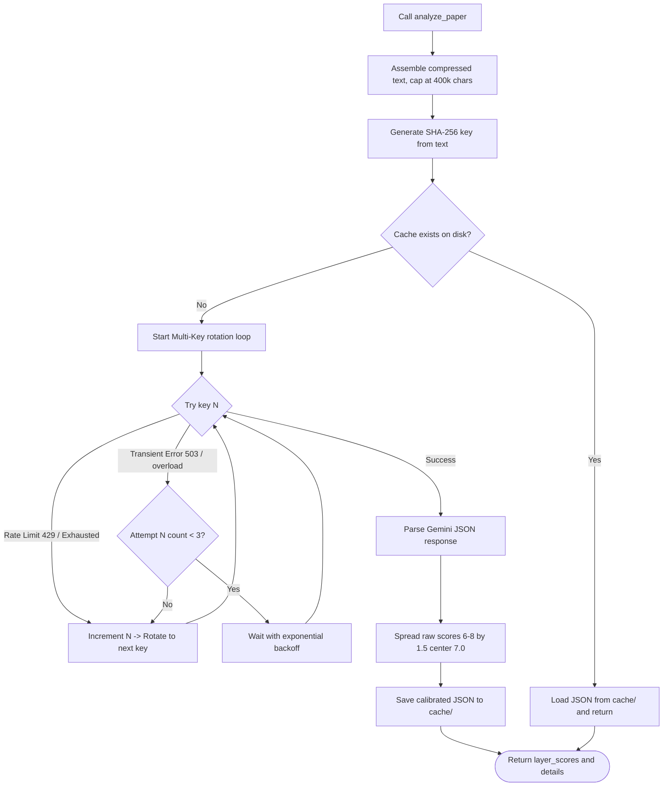

---

## 8. scoring.py — Adaptive Scoring Matrix

* **Diagram Type:** Weighted calculation flowchart
* **AI Image Gen Prompt:**
  > A data flow math diagram. Inputs of 5 layer scores are mapped to different weight percentages depending on the target academic discipline. Labeled weight values for Computer Science, Math, Medicine, and Humanities, compiling into a unified formula, rounding to a final score and assigning a letter grade pill. Crisp typography.
* **Mermaid Code:**
```mermaid
flowchart TD
    Inputs[5 Layer Scores: 0.0 - 10.0] --> DiscMap{Target Discipline?}
    
    DiscMap -->|Computer Science / other| CS[Str: 20% | Clr: 22.5% | Met: 22.5% | Evid: 20% | Cite: 15%]
    DiscMap -->|Mathematics| Math[Str: 15% | Clr: 15% | Met: 17.5% | Evid: 37.5% | Cite: 15%]
    DiscMap -->|Medicine / Biology| Med[Str: 17.5% | Clr: 15% | Met: 32.5% | Evid: 20% | Cite: 15%]
    DiscMap -->|Humanities / Social| Hum[Str: 17.5% | Clr: 32.5% | Met: 15% | Evid: 20% | Cite: 15%]
    
    CS & Math & Med & Hum --> Sum[Calculate Weighted Sum raw score]
    Sum --> Scale[Scale to 100: final_score = round raw * 10]
    Scale --> GradeCheck{final_score threshold?}
    
    GradeCheck -->|>= 85| A[Grade A - Excellent]
    GradeCheck -->|>= 70| B[Grade B - Good]
    GradeCheck -->|>= 55| C[Grade C - Needs Improvement]
    GradeCheck -->|>= 40| D[Grade D - Poor]
    GradeCheck -->|< 40| F[Grade F - Very Poor]
    
    A & B & C & D & F --> Out([Return final_score + grade_letter])
```

---

## 9. citation_checker.py — Reference Telemetry & Validation

* **Diagram Type:** Validation flowchart
* **AI Image Gen Prompt:**
  > A reference validation flow diagram. Input text split into standard DOI lookups using CrossRef REST API and fuzzy title search queries to Semantic Scholar with a 0.6 similarity limit. Includes recency score tracking and duplicate reference warning flags. Labeled paths, clear metrics, modern engineering design.
* **Mermaid Code:**
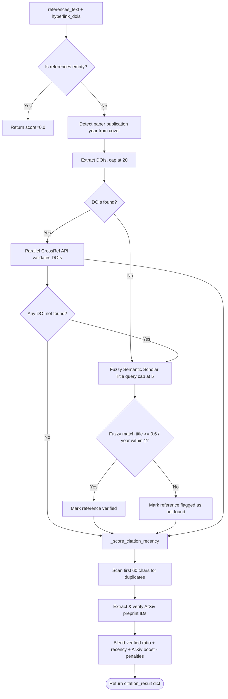

---

## 10. report_generator.py — ReportLab PDF Engine

* **Diagram Type:** Hybrid compiler layout
* **AI Image Gen Prompt:**
  > A visual architecture layout diagram of a PDF document compiler. Displays a dark navy background cover page generated via Canvas callbacks on the left, and a multi-page flowable story builder (ScoreHero, ProgressBars, 2-column parameter scorecards, citation tables, and VerdictCards) compiled by PLATYPUS on the right, saving into an in-memory buffer. Flat vector.
* **Mermaid Code:**
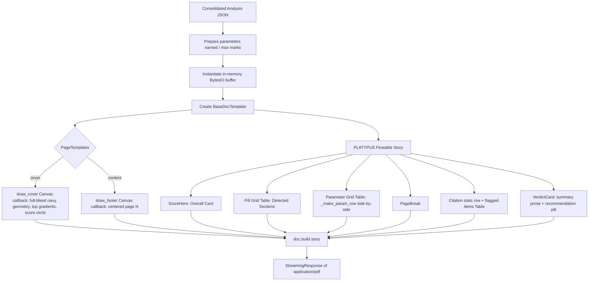

---

## 11. app.js — Frontend SPA State Controller

* **Diagram Type:** State machine diagram
* **AI Image Gen Prompt:**
  > A state machine diagram of a web application UI. Transitions from DomContentLoaded starting HealthCheck, landing in UploadIdle dropzone. Analyzing trigger launches simulated progress bar, leading to populated Dashboard displaying gauge SVG arc, accordion chevrons, and downloads. Glassmorphic details, neon accents.
* **Mermaid Code:**
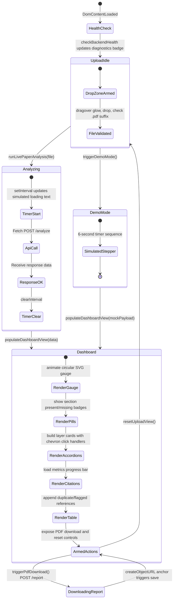

---

## 12. electron/main.js — Desktop Process Bootloader

* **Diagram Type:** Sequence diagram
* **AI Image Gen Prompt:**
  > A sequence diagram showing desktop application process lifecycles. Horizontal lines representing Electron App Core, Splash Window, Main App Window, Port Finder, and Python Uvicorn child process. Shows splash launch, port discovery, uvicorn background spawning, loadURL, splash close, and IPC bridge window controls. High tech theme.
* **Mermaid Code:**
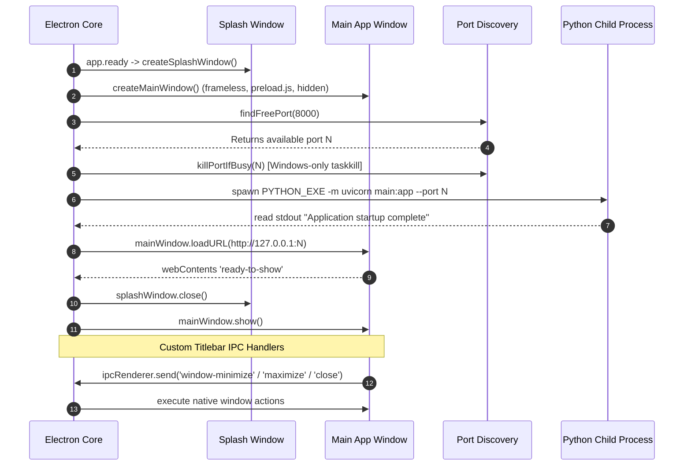
