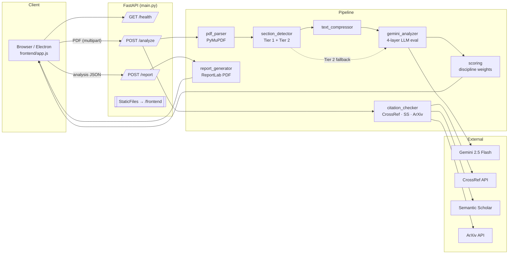
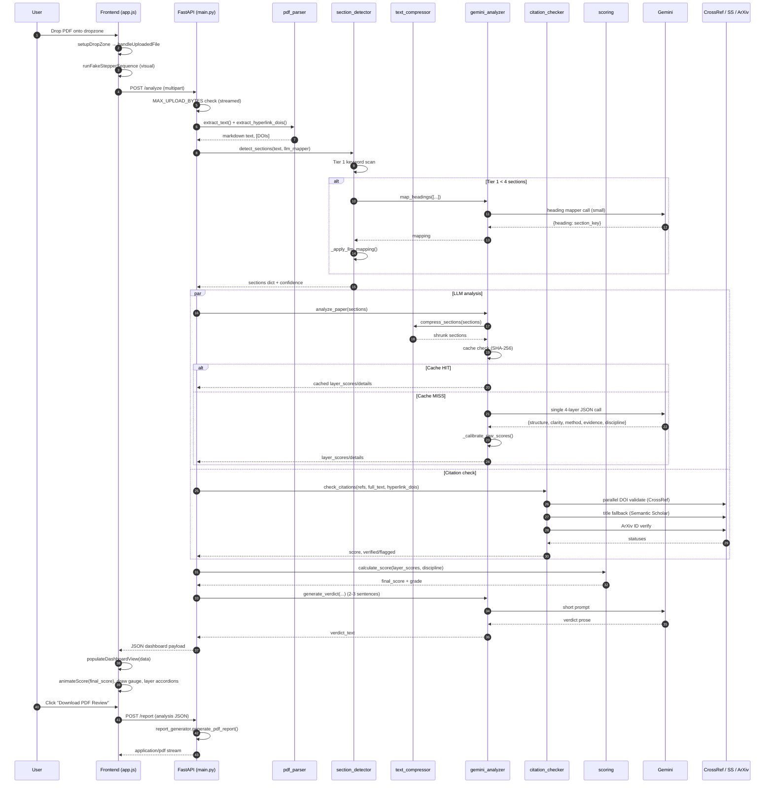
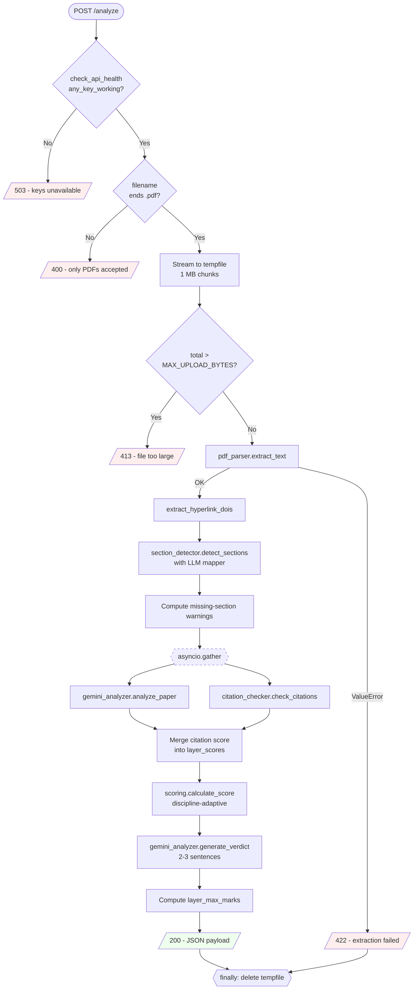
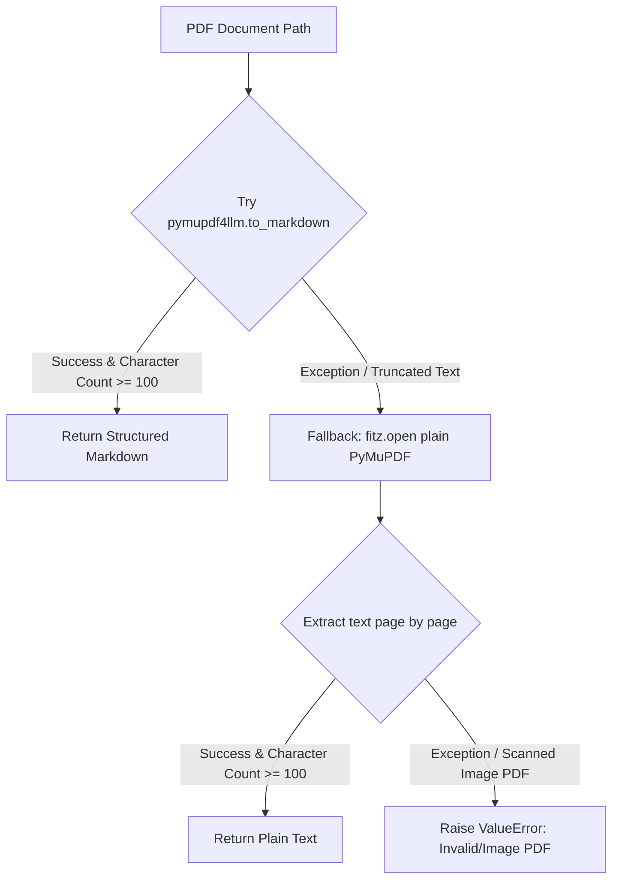
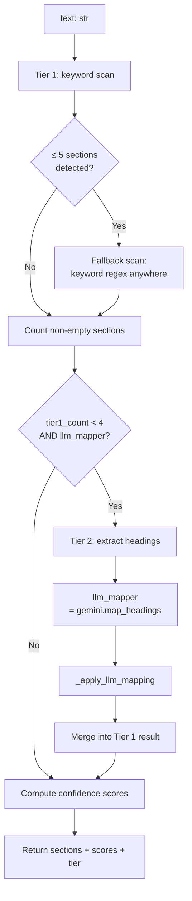
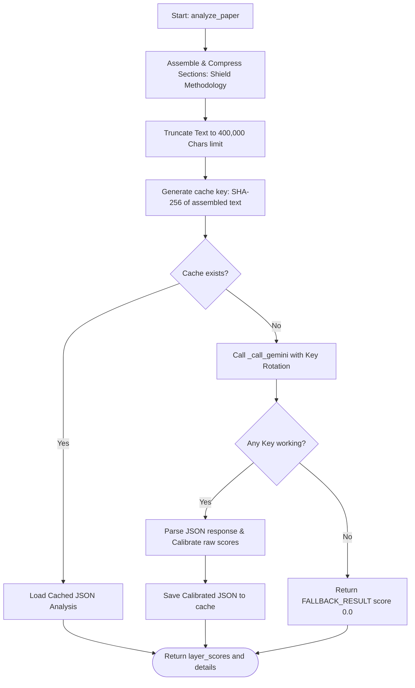
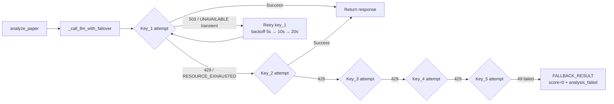
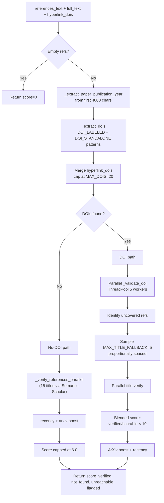
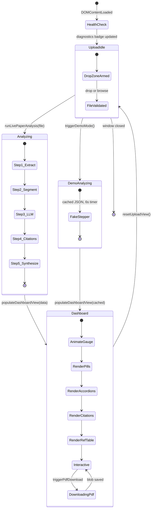
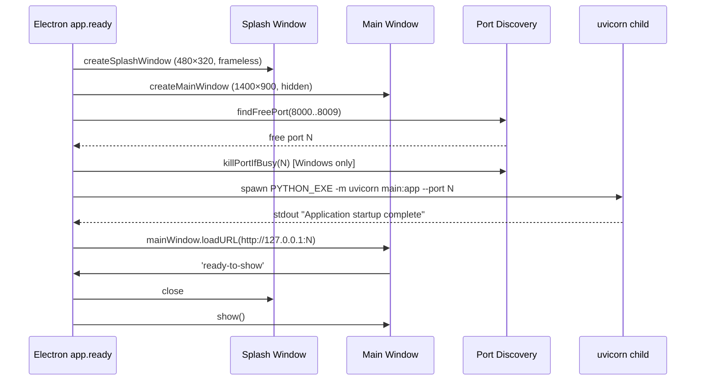

# ResearchSense — End-to-End Technical Manual

> A low-level guide to the codebase. Every module, every important function, with
> line references and diagrams. Read top-to-bottom to understand the system, or
> jump to a module section to understand one piece in isolation.

***

## Table of Contents

1. [What ResearchSense is](#1-what-researchsense-is)
2. [Repository Layout](#2-repository-layout)
3. [High-Level Architecture](#3-high-level-architecture)
4. [End-to-End Request Lifecycle](#4-end-to-end-request-lifecycle)
5. [Backend Module Reference](#5-backend-module-reference)
   * 5.1 [`main.py`](#51-mainpy--fastapi-orchestrator) [— FastAPI orchestrator](#51-mainpy--fastapi-orchestrator)
   * 5.2 [`pdf_parser.py`](#52-pdf_parserpy--text--hyperlink-doi-extraction) [— text + hyperlink DOI extraction](#52-pdf_parserpy--text--hyperlink-doi-extraction)
   * 5.3 [`section_detector.py`](#53-section_detectorpy--two-tier-structural-parser) [— two-tier structural parser](#53-section_detectorpy--two-tier-structural-parser)
   * 5.4 [`text_compressor.py`](#54-text_compressorpy--deterministic-prompt-shrinking) [— deterministic prompt shrinking](#54-text_compressorpy--deterministic-prompt-shrinking)
   * 5.5 [`gemini_analyzer.py`](#55-gemini_analyzerpy--llm-client-with-key-rotation) [— LLM client with key rotation](#55-gemini_analyzerpy--llm-client-with-key-rotation)
   * 5.6 [`scoring.py`](#56-scoringpy--discipline-adaptive-weighting) [— discipline-adaptive weighting](#56-scoringpy--discipline-adaptive-weighting)
   * 5.7 [`citation_checker.py`](#57-citation_checkerpy--doi--title--arxiv-verification) [— DOI + title + ArXiv verification](#57-citation_checkerpy--doi--title--arxiv-verification)
   * 5.8 [`report_generator.py`](#58-report_generatorpy--reportlab-pdf-assembler) [— ReportLab PDF assembler](#58-report_generatorpy--reportlab-pdf-assembler)
6. [Frontend](#6-frontend)
7. [Electron Desktop Shell](#7-electron-desktop-shell)
8. [Configuration Reference](#8-configuration-reference)
9. [Data Contracts (JSON payloads)](#9-data-contracts-json-payloads)
10. [Deployment](#10-deployment)
11. [Developer & Debug Tooling](#11-developer--debug-tooling)
12. [Component Summary Matrix](#12-component-summary-matrix)

***

## 1. What ResearchSense is

ResearchSense is an **AI-assisted quality assessment tool for academic PDFs**. A
user uploads a research paper; the system returns:

* A 0–100 confidence score plus a letter grade (A / B / C / D / F).
* Five per-layer breakdowns (Structure, Clarity, Methodology, Evidence, Citations)
  with issues and suggestions.
* Verified vs. flagged citation counts (via CrossRef, Semantic Scholar, ArXiv).
* A downloadable, styled PDF review report.

The product ships in three form factors from the **same** Python backend:

* **Web app** (Render deployment — `render.yaml`).
* **Local dev** (`uvicorn main:app`).
* **Windows desktop** (portable `ResearchSense.exe` built by `electron-builder`
  bundling `venv` + backend + frontend).

The backend is a single FastAPI process. All heavy lifting — LLM calls, HTTP
lookups, PDF rendering — runs in that one process using `asyncio.to_thread`
for parallelism.

***

## 2. Repository Layout

```
mini project/
├── MAIN_PROJECT/               ← Python backend (FastAPI + pipeline)
│   ├── main.py                 ← HTTP endpoints, upload handling, orchestration
│   ├── pdf_parser.py           ← PDF → text / hyperlink DOIs
│   ├── section_detector.py     ← Text → {abstract, intro, methods, …}
│   ├── text_compressor.py      ← Whitespace + boilerplate pruning
│   ├── gemini_analyzer.py      ← Gemini client, multi-key rotation, caching
│   ├── scoring.py              ← Discipline-adaptive weighted score
│   ├── citation_checker.py     ← CrossRef / Semantic Scholar / ArXiv verifier
│   ├── report_generator.py     ← ReportLab PDF assembler
│   ├── token_budget.py         ← One-off diagnostic script (not runtime)
│   ├── cache/                  ← SHA-256 keyed analysis results (JSON)
│   ├── dev/                    ← Diagnostic scripts, generators, investigation
│   ├── tests/                  ← pytest suite
│   ├── .env                    ← GEMINI_KEY_1..5, COMPRESSION_MODE, etc.
│   ├── Procfile                ← Render/Heroku entrypoint
│   └── requirements.txt
├── frontend/                   ← Static SPA (no framework)
│   ├── index.html              ← Two views: upload / dashboard
│   ├── app.js                  ← Fetches /analyze, /report, renders UI
│   └── style.css               ← Dark theme, CSS variables, glass panels
├── electron/                   ← Desktop shell
│   ├── main.js                 ← Boots backend as child process
│   ├── preload.js              ← contextBridge for window controls
│   ├── splash.html             ← Loading splash while backend warms up
│   └── package.json            ← electron-builder config
├── docs/                       ← This manual + prior reports & figures
├── .planning/                  ← GSD workflow artifacts (phases, plans)
├── dist/                       ← Packaged .exe (electron-builder output)
├── render.yaml                 ← Render web-service manifest
├── DEPLOY.md                   ← Deployment cheatsheet
└── Start_ResearchSense.bat     ← One-click launch (local venv activation)
```

Two folders in `MAIN_PROJECT/` are runtime-mutable: **`cache/`** (SHA-256 keyed
Gemini responses, safe to delete) and the `.env` (secrets — never commit).

***

## 3. High-Level Architecture



**Key design principles:**

1. **Single-pass LLM.** All four qualitative layers (Structure, Clarity,
   Methodology, Evidence) are graded in one Gemini call — not four. Uses Gemini's
   native JSON mode + response schema, so no regex parsing. See §5.5.
2. **Parallel independent I/O.** Inside `/analyze`, the LLM call and the
   citation check are dispatched with `asyncio.gather` so their latencies
   overlap (`main.py:218`).
3. **Multi-key failover.** Up to 5 Gemini API keys are loaded; a 429 on one
   rotates to the next (§5.5).
4. **Two-tier structural detection.** Fast keyword matching handles \~80% of
   papers with zero API cost; a tiny LLM heading-mapper only fires when Tier 1
   finds < 4 sections (§5.3).
5. **Caching.** Analysis results are keyed by a SHA-256 hash of the assembled
   prompt text. Re-uploading the same paper returns instantly with zero API
   calls (`gemini_analyzer.py:245-280`).
6. **Discipline-adaptive scoring.** Weights differ per discipline (CS, math,
   physics, chem, biomed, humanities). Gemini classifies the discipline in the
   same call that scores the layers (§5.6).
7. **Score calibration.** LLMs cluster their outputs in 6–8 even for markedly
   different papers. A linear stretch around 7.0 spreads them so good papers
   pull visibly ahead of mediocre ones (`gemini_analyzer.py:405-437`).

***

## 4. End-to-End Request Lifecycle

The path a single uploaded PDF takes from browser to rendered dashboard.



The `/analyze` handler blocks only during `await asyncio.gather(...)`. That gather
runs the LLM eval and the citation checks in parallel threads (they are both
sync-blocking I/O). Total wall time ≈ `max(LLM_latency, citation_latency)`, not
their sum — usually 10–20 s depending on paper size and Gemini load.

***

## 5. Backend Module Reference

### 5.1 `main.py` — FastAPI orchestrator

**Role:** HTTP surface, upload streaming, orchestration, static frontend hosting.
**Size:** \~355 lines. **No business logic** — every domain step is delegated.

#### Endpoints

| Method | Path              | Purpose                                       | Line |
| ------ | ----------------- | --------------------------------------------- | ---- |
| GET    | `/health`         | Non-quota-burning liveness probe              | 96   |
| POST   | `/analyze`        | The core pipeline — PDF → analysis JSON       | 134  |
| POST   | `/report`         | Analysis JSON → downloadable PDF report       | 289  |
| GET    | `/compress-stats` | Diagnostic — reports current compression mode | 322  |
| GET    | `/*` (mount)      | Serves `frontend/` via `StaticFiles`          | 342  |

#### Notable code

* **Env loading** (line 15–17): `.env` is read **relative to** **`__file__`** so
  `python -m uvicorn main:app` works from any cwd — critical for Electron
  packaging.
* **Upload cap** (line 39): `MAX_UPLOAD_BYTES` = `MAX_UPLOAD_MB × 1024²`
  (default 30 MB). Enforced during the streamed chunked read (line 163–183),
  so the process **never buffers a whole PDF in RAM** just to reject it.
* **CORS** (line 44–51): comma-separated `ALLOWED_ORIGINS` env var, or `"*"`.
  Same-origin hits (StaticFiles frontend) don't need it.
* **Filename sanitization** (line 79 `_safe_download_name`): strips
  control chars, path separators, and quotes before injecting a filename into
  a `Content-Disposition` header — prevents header injection.
* **Payload models** (`CitationResult` line 55, `ReportPayload` line 64): Pydantic
  models used by `/report` to validate the JSON the frontend echoes back.
* **`_probe`** (line 88): thin `HEAD` probe used by `/health` to check
  CrossRef and Semantic Scholar reachability. Wrapped in
  `asyncio.to_thread` so the event loop is never blocked.
* **Health overall-status logic** (line 106–132): `overall_status = "healthy"`
  *only* if at least one Gemini key is configured. **CrossRef / Semantic
  Scholar outages do NOT flip the badge** — they're graceful-degradation paths
  only. This is intentional: an SS outage shouldn't block analysis.

#### `/analyze` — visual flow



The `asyncio.gather` node (dashed) is the parallel wait — the LLM call and the
citation check overlap; total wall time is `max()` of the two, not the sum.

#### `/analyze` flow (line 134–287) — annotated

```
1. check_api_health()                      ← 503 if all Gemini keys dead
2. validate extension → .pdf only
3. Stream file to tempfile, aborting at MAX_UPLOAD_BYTES (413)
4. pdf_parser.extract_text(tmp)            ← markdown text
   pdf_parser.extract_hyperlink_dois(tmp)  ← invisible DOIs from PDF annotations
5. section_detector.detect_sections(
       text, llm_mapper=gemini_analyzer.map_headings)
6. Generate soft "missing section" warnings
7. asyncio.gather(
       gemini_analyzer.analyze_paper(sections)   ← 4 layers in ONE Gemini call
       citation_checker.check_citations(refs)     ← DOI + title + ArXiv
   )                                       ← THIS IS THE PARALLEL BIT
8. Merge citation score into layer_scores["citations"]
9. scoring.calculate_score(layer_scores, discipline)
10. gemini_analyzer.generate_verdict(...) ← LLM writes 2-3 sentence blurb
11. Compute per-layer max marks in Python (100·weights) — so the frontend
    doesn't have to replicate the rounding
12. Return unified JSON payload → StaticFiles-served frontend consumes it
```

#### `/report` flow (line 289–319)

Accepts the exact JSON the frontend received from `/analyze`. **Does not
re-run any AI or CrossRef work.** Streams the PDF back via a
`StreamingResponse` with a sanitized `Content-Disposition` header. Any
exception is caught and returned as a generic `500` (no internal details
leak to clients).

***

### 5.2 `pdf_parser.py` — text + hyperlink DOI extraction

**Role:** Turn a PDF file path into raw text + a list of DOI strings found in
clickable annotations. **\~90 lines, no LLM, no external HTTP.**



#### Public functions

##### `extract_text(pdf_path) → str` (line 51)

Two-stage extraction:

```
PyMuPDF4LLM.to_markdown()        ── primary: structured markdown, better for
       │                            downstream Tier-1 section detection
       ▼  (len < 100 chars? or throws?)
fitz.get_text("text", sort=True) ── fallback: sort=True reorders blocks by
                                    reading order, which is critical for
                                    two-column layouts (papers)
```

If both fail (or produce < 100 chars — likely a scanned/image-only PDF), it
raises `ValueError`, which `main.py` turns into a `422` with a friendly
message.

##### `extract_hyperlink_dois(pdf_path) → list[str]` (line 6)

Many publishers (ACL, IEEE, Springer) embed DOIs as **clickable link
annotations** in the reference list but do **not print the DOI text**.
Text-only extraction misses them entirely, which historically produced
"no DOIs found" false negatives.

The function walks every page's `page.get_links()` list, greps each URI for
a DOI pattern (`10.\d{4,9}/…`), strips trailing punctuation, deduplicates,
and returns the list. On any exception the function returns `[]` — the
pipeline continues without DOI enrichment. The list is merged into
`citation_checker`'s DOI pool (§5.7).

***

### 5.3 `section_detector.py` — two-tier structural parser

**Role:** Split raw text into the standard academic sections. Emits a
confidence-scored map for UI display.

Output shape:

```Python
{
  "sections":          {"abstract": "...", "introduction": "...", ...},
  "detected_sections": {"Abstract": 96, "Introduction": 94, ...},
  "tier": 1 | 2,
}
```

#### The two-tier flow



#### Function-level

* **`SECTION_KEYWORDS`** (line 18): the canonical keyword table — e.g.
  `methodology` matches on `"methodology"`, `"methods"`, `"approach"`,
  `"experimental setup"`, `"materials and methods"`, `"data collection"`.
* **`STOP_KEYWORDS`** (line 38): headings that terminate accumulation
  (`appendix`, `acknowledgements`, `data availability`, `checklist`, etc).
* **`_clean_heading(line)`** (line 54): normalizes a heading — strips `##`,
  `**`, section numbers (`3.1`), roman numerals, trailing em-dash/colon/period.
  Returns lowercase text for comparison.
* **`_is_heading_line(line)`** (line 70): classifies a line as heading or
  body. Detects: `#` markdown, ALL CAPS, numbered `1. Intro`, roman `II.
  Results`, and short standalone lines without a trailing period. **Explicitly
  excludes bibliographic list items** like `[12] J. Smith, ...` so reference-list
  entries aren't mistaken for section breaks.
* **`_extract_all_headings(text)`** (line 112): pulls top-level heading
  candidates for the Tier 2 LLM mapper. Only top-level (`3 Foo`) not
  sub-sections (`3.1 Foo`), capped at 40 headings — keeps the LLM prompt
  \~50 tokens.
* **`_apply_llm_mapping(lines, raw_heading_map)`** (line 161): re-scans the
  paper using Gemini's output as the heading→section dictionary. Unknown
  headings are treated as sub-headings and appended to the current section.
* **`detect_sections(text, llm_mapper=None)`** (line 220): the public entry
  point. Tier 2 is opt-in via the `llm_mapper` callable — passing `None`
  disables it.

#### Tier 1 subtleties

* **Bibliographic protection** (line 262–271): inside `references`, lines
  containing stop-keywords like `funding` or `appendix` are treated as
  bibliography content (**not** section breaks) unless the line is *also* a
  markdown header or fully uppercase.
* **Fallback scan** (line 299–322): if Tier 1 detected ≤ 5 sections, for
  each **missing** section it scans the entire text for the keyword *anywhere*,
  grabs up to 2000 chars, and stops at the next section's keyword. This
  recovers content in flat/malformed papers.

#### Confidence scoring (line 367–398)

Base 70 (Tier 1) or 85 (Tier 1 matched via markdown heading) or 88 (Tier 2).
Bonus by content length (+10 for ≥ 20 lines, +7 for ≥ 10, +4 for ≥ 5, else +2),
plus a deterministic hash-based nudge so identical-length sections don't all
score identically. Clamped to `[80, 99]`.

***

### 5.4 `text_compressor.py` — deterministic prompt shrinking

**Role:** Cut assembled paper text by 30–55% (light) or 40–65% (aggressive)
before it reaches Gemini. Pure regex + string ops. Zero API cost, zero latency.

Controlled by `COMPRESSION_MODE` (env var: `off` | `light` | `aggressive`).

#### The section-aware pipeline

Each section has a rule (`SECTION_COMPRESSION_RULES`, line 97):

| Section        | Rule      | Reasoning                                                       |
| -------------- | --------- | --------------------------------------------------------------- |
| `abstract`     | `none`    | Tiny + every word matters                                       |
| `introduction` | `light`   | Boilerplate removal fine                                        |
| `related_work` | `light`   | Citation markers safely strippable                              |
| `methodology`  | `none`    | Also shielded in `gemini_analyzer` — never touch technical text |
| `results`      | `minimal` | Dedup + whitespace only; NEVER remove evidence pointers         |
| `discussion`   | `light`   | No raw numbers to protect                                       |
| `conclusion`   | `none`    | Small + key claims                                              |
| `references`   | `none`    | `citation_checker` needs raw text (DOIs, authors, titles)       |

#### Stages inside `_compress_section` (line 247)

```
Stage 1 (always run for non-"none" sections):
  _normalize_whitespace   ← form-feed, BOM, CRLF, collapse spaces/newlines
  _remove_url_noise       ← "https://..." → "[URL]"
  _remove_citations       ← "[12]", "(Smith et al., 2020)", superscripts
  _remove_formula_lines   ← lines with 0% alphabetic chars

Stage 2 (minimal — results only):
  _deduplicate_sentences  ← exact within-section dedup only
  → done

Stage 3 (light / aggressive):
  _remove_boilerplate_sentences
    ── strips ONLY the matched filler phrase + trailing comma,
       preserving factual continuation (e.g. "our model outperforms
       by 3.2%" survives even if "As shown in Table 1," is dropped)
    ── evidence-pointer patterns ("As shown in Figure 2") are
       preserved in results/discussion (strip_evidence=False)
  _deduplicate_sentences

Stage 4 (aggressive only, NOT for results):
  _remove_formula_lines(aggressive=True)  ← <40% alphabetic chars
```

#### Public API

**`compress_sections(sections, mode="light") → dict`** (line 303)

Returns the same-keyed dict plus a `_compression_stats` metadata key:

```Python
{
  "mode": "light",
  "total_original_chars": 48213,
  "total_compressed_chars": 26845,
  "reduction_pct": 44.3,
  "per_section": {"introduction": {"original": ..., "compressed": ..., "pct": ...}, ...}
}
```

**Never compressed:** the `references` section (bypassed at line 389) — the
citation checker needs raw text intact.

***

### 5.5 `gemini_analyzer.py` — LLM client with key rotation

**Role:** The only module that talks to Gemini. Handles key rotation, structured
output, caching, calibration, and the two prompt shapes (paper analysis +
heading mapping).



#### Multi-key failover



Loaded at import time (line 51–70): reads `GEMINI_KEY_1` through
`GEMINI_KEY_5` from `.env`. `_clients` is a list of `(name, client)` tuples.
If **zero** keys load, module import raises `RuntimeError` — the whole app
fails to start.

#### Function reference

##### `_call_single_key(name, client, prompt, ...)` (line 295)

Calls Gemini with **one** key. Returns raw text on success, raises on error.

* Config knobs (line 313–330): `temperature=0.0`, `top_p=0.8`,
  `max_output_tokens=8000`. When `use_structured_output=True`, sets
  `response_mime_type="application/json"` and attaches the schema so
  Gemini's native JSON mode enforces valid output.
* Retries `503 / UNAVAILABLE / overloaded` up to 3 times with exponential
  backoff (5 → 10 → 20 → 60 s cap). Reads the API's suggested `retryDelay`
  when present (`_parse_retry_delay`, line 285).
* **Does not retry on 429** — instead raises so the outer loop rotates keys.

##### `_call_llm_with_failover(prompt, ...)` (line 354)

Iterates `_clients` in order. On 429 or any other failure, moves to the next
key. Returns first-success text. If all keys fail, raises `RuntimeError`.

##### `_call_gemini(prompt) → dict` (line 379)

Wrapper that uses structured output + `SYSTEM_PROMPT` as
`system_instruction` (Gemini caches system instructions across calls, so
subsequent calls are faster). On persistent failure, returns
`FALLBACK_RESULT` — a sentinel with `analysis_failed=True` that
downstream code recognizes to skip caching.

##### `analyze_paper(sections) → dict` (line 441)

**The main pipeline function.** Runs all 4 qualitative layers in ONE Gemini
call. Steps:

```
1. Read COMPRESSION_MODE.
2. Save raw methodology (never compressed).
3. text_compressor.compress_sections(sections, mode)
   ── restore raw methodology (shielding)
4. Extract figure/table captions from every section (CAPTION_RE, line 214)
   ── captions carry the densest quantitative claims
   ── de-dupe, cap at 25, append as "[FIGURE & TABLE CAPTIONS]" block
5. Assemble sections in SECTION_ORDER (line 541) with per-section char limits:
       abstract 5k, introduction 30k, related 15k,
       methodology 60k, results 60k, discussion 30k, conclusion 10k
   Cap total at MAX_TOTAL = 400 000 chars.
   Use _smart_truncate — cut at the last sentence boundary, not mid-word.
6. Hash the assembled text (SHA-256, first 16 chars) → _get_cache_key
   ── if cache/{key}.json exists, return it (0 API calls)
7. _call_gemini(user_message) → validated JSON with:
       structure_sections, clarity_writing, methodology_rigor,
       evidence_claims, discipline
8. Normalize the layer_details dict — ensure score/issues/suggestions keys.
9. Clamp scores to [0.0, 10.0].
10. _calibrate_raw_scores — stretch the LLM's narrow 6-8 band around 7.0
    by ×1.5. Score 0 preserved as "section missing" sentinel. Citations
    layer excluded — it comes from citation_checker.
11. Save to cache (only if not analysis_failed).
```

##### `map_headings(headings) → dict[str,str]` (line 651)

The Tier 2 hook consumed by `section_detector`. Sends only the heading list
(50–150 tokens) with `HEADING_MAP_SYSTEM` (line 223) and
`HEADING_MAP_SCHEMA`. Uses the same failover client. Cached by hash of the
ordered heading list.

##### `check_api_health() → dict` (line 718)

Sends a tiny `"ping"` prompt to **each** key, one attempt only. Returns
per-key status (`ok` / `error: 429` / `error: 403` / etc.) and
`any_key_working: bool`. Called at the top of every `/analyze` — a 503 is
returned if none work.

##### `generate_verdict(...)` (line 765)

Writes the 2–3 sentence verdict paragraph shown at the top of the report
and dashboard. Picks the two lowest-scoring layers, feeds their top issues
into a small prompt, calls Gemini. On failure, falls back to a hardcoded
grade-appropriate template.

#### The `SYSTEM_PROMPT` (line 137)

Two important behaviors baked in:

* **Structure-agnostic scoring**: "high-quality papers use custom section names.
  Do NOT penalize `Pre-Training` instead of `Methodology`" — prevents low
  scores on industry papers with unconventional headings.
* **Domain-adaptive expectations**: "Don't penalize a theoretical paper for
  lacking experimental baselines, or a survey for lacking novel methodology."
* Explicit **0–10 rubric** with descriptive bands (9–10 exceptional, 7–8 good,
  5–6 adequate, 3–4 weak, 1–2 poor, 0 missing).
* **Discipline classification** in the same JSON — one of
  `computer_science | physics | mathematics | medicine_biology | chemistry | humanities_social | other`.

***

### 5.6 `scoring.py` — discipline-adaptive weighting

**Role:** Turn five layer scores (each 0–10) into a single 0–100 final score
and letter grade. Weights vary by discipline.

#### The weight table (line 5)

Each row sums to 1.0.

| Layer       | CS/other | Math      | Physics   | Chem      | Bio/Med   | Humanities |
| ----------- | -------- | --------- | --------- | --------- | --------- | ---------- |
| Structure   | 0.20     | 0.15      | 0.175     | 0.175     | 0.175     | 0.175      |
| Clarity     | 0.225    | 0.15      | 0.20      | 0.20      | 0.15      | **0.325**  |
| Methodology | 0.225    | 0.175     | **0.275** | **0.275** | **0.325** | 0.15       |
| Evidence    | 0.20     | **0.375** | 0.20      | 0.20      | 0.20      | 0.20       |
| Citations   | 0.15     | 0.15      | 0.15      | 0.15      | 0.15      | 0.15       |

Weighting reflects reviewer priorities in each field: math papers weight
evidence (i.e. proofs) heaviest; bio/med weights clinical-trial rigor;
humanities weights writing quality; physics/chem weight setup reproducibility.

#### `calculate_score(layer_scores, discipline)` (line 75)

```Python
raw = Σ layer_scores[k] × weights[k]        # ∈ [0, 10]
confidence_score = round(raw × 10, 1)        # ∈ [0.0, 100.0]
```

Grade thresholds (`GRADE_MAP`, line 66):

* **A — Excellent** ≥ 85
* **B — Good** ≥ 70
* **C — Needs Improvement** ≥ 55
* **D — Poor** ≥ 40
* **F — Very Poor** < 40

Returns `{"final_score", "grade", "weights", "discipline"}`. Unknown
disciplines silently fall back to `computer_science`.

***

### 5.7 `citation_checker.py` — DOI + title + ArXiv verification

**Role:** Score citation quality on a 0–10 scale. Combines DOI resolution
(CrossRef), title matching (Semantic Scholar), ArXiv preprint checks, duplicate
detection, and recency scoring.

#### Signals used

| Signal                | Source                              | Where in file                         |
| --------------------- | ----------------------------------- | ------------------------------------- |
| DOI resolution        | CrossRef `/works/{doi}`             | `_validate_doi` L422                  |
| DOI (from hyperlinks) | `pdf_parser.extract_hyperlink_dois` | merged at L521                        |
| Title fallback        | Semantic Scholar `/paper/search`    | `_verify_title_semantic_scholar` L317 |
| ArXiv preprint        | ArXiv `/api/query`                  | `_verify_arxiv_id` L132               |
| Duplicate references  | Local text comparison               | `_detect_duplicates` L241             |
| Recency               | Reference publication years         | `_score_citation_recency` L181        |

#### High-level flow



#### Extraction

* **`_extract_dois(references_text)`** (line 78): runs both `DOI_LABELED`
  (`doi.org/…`, `DOI: …`) AND `DOI_STANDALONE` (raw `10.\d{4,}/…`). Earlier
  versions ran them mutually-exclusively and lost standalone DOIs in mixed
  bibliographies. Strips trailing punctuation, deduplicates in discovery
  order, caps at 20.
* **`_clean_doi_parentheses(doi)`** (line 53): only strips a trailing `)` or
  `]` when unmatched. Preserves DOIs that legitimately end with balanced
  brackets (e.g. `10.1000/abc(123)`).
* **`_extract_title_from_ref(ref_line)`** (line 276): three strategies — quoted
  title, text between `(YYYY).` and next period, text between `YYYY.` and
  next period.

#### DOI validation

**`_validate_doi(doi)`** (line 422) — polite `GET https://api.crossref.org/works/{doi}`
with `User-Agent: ResearchSense/1.0 (mailto:team@researchsense.dev)` (CrossRef's
"polite pool" gives 50 req/s). 5 s timeout. One retry on 429/503. Returns
`"verified" | "not_found" | "unreachable"`.

DOIs are validated in parallel with `ThreadPoolExecutor(max_workers=5)`.

#### Title fallback (Semantic Scholar)

**`_verify_title_semantic_scholar(title, ref_year)`** (line 317) — year-aware
matching:

* Fetches top 3 results.
* If a returned paper's year is within ±1 of the reference year, accepts on
  similarity ratio ≥ 0.5.
* Otherwise requires ratio ≥ 0.6.
* Uses `difflib.SequenceMatcher` for similarity.

Rate-limit protection: capped at `MAX_TITLE_FALLBACK = 5` queries per paper
(line 12). Samples are spread proportionally across the uncovered
references so we sample from the whole bibliography, not just the top of it
(line 663–670).

#### Recency scoring (line 181)

**`_score_citation_recency`** uses the paper's own detected publication year
(`_extract_paper_publication_year`, line 153) as the baseline — so a 2019
paper isn't penalized for lacking 2024 refs. Bands:

| % refs from last 3 yrs | Score | Note                 |
| ---------------------- | ----- | -------------------- |
| ≥ 35%                  | 10.0  | "excellent currency" |
| ≥ 20%                  | 8.0   | "good currency"      |
| ≥ 8%                   | 6.0   | "moderate currency"  |
| < 8%                   | 4.0   | "may be outdated"    |

Final score blends DOI/title verification (80%) with recency (20%).

#### Score capping rules

* **No-DOI cap:** if zero DOIs are found anywhere, final citation score is
  capped at **6.0** (line 611). Papers without verifiable DOIs shouldn't score
  above "adequate" regardless of title-match performance.
* **All-unreachable neutral:** if every DOI attempted was unreachable, returns
  a neutral 7.0 rather than punishing the paper for a transient outage (line
  749\).

#### Return payload

```Python
{
  "score": float,          # 0-10, blended
  "total_refs": int,
  "verified": int,         # DOI+title verified
  "not_found": int,
  "unreachable": int,
  "arxiv_verified": int,
  "flagged_dois": [str],
  "flagged_items": [{"citation", "category": "duplicate"|"not_found", "detail"}],
  "recency": {...},
  "issues": [str],
  "suggestions": [str],
}
```

***

### 5.8 `report_generator.py` — ReportLab PDF assembler

**Role:** Take the `/analyze` JSON payload and produce a styled A4 PDF.
\~970 lines. Uses ReportLab **PLATYPUS** hybrid: `BaseDocTemplate` +
custom `Flowable` subclasses + `Canvas` callbacks for the cover.

#### Report structure

```
Page 1  ─┬─ Full-bleed dark navy Canvas cover (draw_cover)
        │  • Brand logo & gradient bar
        │  • Metadata grid (filename, timestamp, params, status)
        │  • Circular score badge

Page 2+ ─┬─ ScoreHero flowable (circular score + grade pill + title)
        ├─ Detected Sections pillar grid (_build_detected_sections)
        ├─ Verdict Card (dark header + prose + recommendation pill)
        ├─ 5-layer parameter grid (_build_param_grid)
        │  Each cell: name, earned/max marks, progress bar, issues, suggestions
        └─ Citation Verification block (_build_citation_section)
           • Summary row, flagged items table, flagged DOIs, unreachable notes

Every page ── draw_footer (page number + doc title)
```

#### Color tokens (line 51)

Single source of truth so no hex codes are hardcoded in components:
`C_PRIMARY` (dark navy), `C_ACCENT` (blue), `C_ACCENT2` (purple),
`C_WARNING` (amber), `C_SUCCESS` (green), `C_DANGER` (red), `C_LIGHT`,
`C_TEXT`, `C_MUTED`, `C_BORDER`.

#### Custom Flowables

| Class           | Line | What it draws                                      |
| --------------- | ---- | -------------------------------------------------- |
| `ProgressBar`   | 319  | Horizontal bar; fill % + color mapped from score   |
| `ScoreHero`     | 342  | Circular score gauge + grade pill + quality title  |
| `SectionHeader` | 398  | H1-style header used above each report section     |
| `VerdictCard`   | 433  | Dark rounded card containing the verdict paragraph |

#### Key helpers

* **`_sanitize(text)`** (line 35): escapes HTML entities and strips `**`
  markdown bold. Every text passed to `Paragraph()` runs through this to
  prevent ReportLab's XML parser from breaking on stray `<` or `&`.
* **`S(name, **kw)`** (line 132): factory for `ParagraphStyle` — auto-suffixed
  unique name (ReportLab requires unique style names) with sensible defaults.
* **`_bar_color(pct)`** (line 497): score → color (`C_SUCCESS` ≥ 70,
  `C_WARNING` ≥ 40, else `C_DANGER`).
* **`_make_param_cell(name, score, total, issues, suggestions)`** (line 507):
  builds one 2×N-cell block for a single quality layer. Score expressed as
  `earned / max` (e.g. `18 / 22.5`).
* **`_build_param_grid(parameters)`** (line 589): lays out five parameter cells
  as a 2-column ReportLab `Table` (last row spans if odd count).
* **`_build_citation_section(citation_data)`** (line 604): summary counts +
  flagged items table + flagged DOIs list. Handles the "no DOIs found" case
  gracefully.
* **`_build_detected_sections(detected_sections)`** (line 757): 3-column pill
  grid — each pill is `{"Section Name", "94%"}`.
* **`_build_story(report_data)`** (line 800): assembles the full PLATYPUS
  `story` list in order.

#### Public entry point

**`generate_pdf_report(...)`** (line 863):

```Python
def generate_pdf_report(
    filename: str,
    layer_scores: dict,
    layer_details: dict,
    final_score: float,
    grade: str,
    citation_result: dict,
    detected_sections: dict = None,
    verdict_text: str = None,        # if None, calls _generate_verdict_paragraph
    discipline: str = None,          # discipline-adaptive max marks
) -> io.BytesIO
```

Builds a `BaseDocTemplate` with **two page templates**:

* `"cover"` — no frame, `draw_cover` as the `onPage` callback.
* `"content"` — one frame, `draw_footer` as the `onPage` callback.

The story starts with `NextPageTemplate("content")` + `PageBreak()` so page 1
uses the cover template and pages 2+ use the content template. Returns an
`io.BytesIO` buffer ready to stream.

***

## 6. Frontend

`frontend/index.html` + `app.js` + `style.css`. **No framework** — vanilla
DOM manipulation. Two view states in the same HTML: **upload** and **dashboard**,
toggled by `showView(name)`.

#### View 1: Upload

* **Dropzone** (line 60) with hidden `<input type="file">`.
* **"Try Demo" button** loads a bundled pre-cached JSON (offline path,
  no API call).
* **Stepper loader** (line 86) — 5 named steps, only shown while analysis is
  running. Each step's `○ → ● → ✓` state is driven by
  `updateStepStatus(stepNum, status)` in JS.

#### View 2: Dashboard

* **Score Hero card** with SVG circular gauge, grade badge, recommendation.
* **Detected Sections pillar grid** with confidence % pills.
* **Layer accordion list** — 5 layers, each expandable to reveal issues +
  suggestions in a split view.
* **Verdict Card** with the LLM-authored paragraph and a "Download PDF" button.
* **Citation Metrics card** with total / verified / flagged counters and a
  verification-rate progress bar.
* **References Validator table** (12-col span at the bottom) with per-row
  citation, method (CrossRef / Semantic Scholar / ArXiv), status badge, and
  impact metadata.

#### `app.js` function map

| Function                                               | Line        | What it does                                                    |
| ------------------------------------------------------ | ----------- | --------------------------------------------------------------- |
| `extractErrorMessage(payload)`                         | 40          | Flattens FastAPI `HTTPException` payloads to a display string   |
| `showView(viewName)`                                   | 64          | Toggles the two `.view-state` divs                              |
| `checkBackendHealth()`                                 | 83          | Polls `GET /health` on load; cold-start retry loop (up to 60 s) |
| `setupDropZone()`                                      | 138         | Wires drag/drop + click-to-browse                               |
| `handleUploadedFile(file)`                             | 181         | Validates type, kicks off `runLivePaperAnalysis`                |
| `_renderNextToast/_dismissToast/showToastNotification` | 202/219/230 | Queued slide-in toast system                                    |
| `resetStepper/updateStepStatus`                        | 244/252     | Manages the 5-step visual progress display                      |
| `runFakeStepperSequence(cb)`                           | 272         | Advances stepper on a timer (visual only)                       |
| `runLivePaperAnalysis(file)`                           | 303         | `POST /analyze` with `FormData`, runs stepper in parallel       |
| `animateScore(target)`                                 | 374         | 0→target counter animation on the circular gauge                |
| `populateDashboardView(data)`                          | 393         | Binds `/analyze` JSON into every dashboard element              |
| `triggerPdfDownload()`                                 | 785         | `POST /report` (JSON body), receives blob, triggers download    |
| `triggerDemoMode()`                                    | 834         | Uses bundled sample JSON — no API call                          |
| `resetUploadView()`                                    | 950         | Clears state, goes back to upload                               |

#### Backend contract

* `BACKEND_URL = window.location.origin` (line \~7). Because `main.py` mounts
  the frontend on `/`, dev and prod are same-origin — no CORS headaches.
* **Endpoints hit:**
  * `GET /health` — status badge in the header.
  * `POST /analyze` — multipart `file` field.
  * `POST /report` — sends the *exact* `/analyze` response back as JSON body.

#### Frontend state machine

The sequence diagram in §4 shows the round-trip. This state machine shows what
the UI is doing at any given moment — useful when reading `app.js` top-to-bottom.



#### `style.css` (\~800 lines)

* **CSS variables** (line 6–44): `--bg-base`, `--accent-data` (cyan),
  `--accent-success`, `--accent-danger`, font families, radii, shadows.
* **Fonts:** Inter (UI), JetBrains Mono (data), Outfit (headings).
* **Glass panels:** translucent + `backdrop-filter: blur(14px)`.
* **Grid:** 12-column responsive; breakpoints at 1100 / 768 / 480 px.
* **Layer accordion**: uses animated `grid-template-rows: 0fr → 1fr` for
  smooth expand/collapse without JS height calculation.
* **Toast**: slides in from `right: -400px → right: 24px`.

#### Design tokens (inline reference)

The `:root` block that every component reads from — kept here so you don't need
to open the CSS file to know what a token is:

```CSS
:root {
  /* Surface */
  --bg-base:      #0a0e17;                        /* page background */
  --bg-surface:   hsla(223, 47%, 16%, 0.55);      /* glass panels */
  --bg-raised:    hsla(223, 47%, 20%, 0.70);      /* hover / nested */
  --border-glow:  hsla(0,   0%,  100%, 0.08);     /* subtle dividers */

  /* Semantic accents */
  --accent-data:    #00E5FF;    /* cyan — telemetry / data emphasis   */
  --accent-success: #10B981;    /* green — verified, fix labels       */
  --accent-warning: #F59E0B;    /* amber — mid-range scores           */
  --accent-danger:  #EF4444;    /* red   — flagged, missing sections  */

  /* Typography */
  --font-ui:   'Inter',          sans-serif;
  --font-data: 'JetBrains Mono', monospace;
  --font-hero: 'Outfit',         sans-serif;

  /* Effects */
  --backdrop-blur: blur(14px);
  --radius-lg:     16px;
  --radius-md:     10px;
}
```

The circular score gauge is a pure SVG animation — no JS math:

```CSS
circle.gauge-fill {
  transition: stroke-dashoffset 1.4s cubic-bezier(0.4, 0, 0.2, 1);
}
```

`animateScore()` in `app.js` only updates the text counter; the arc animates by
CSS transition when `strokeDashoffset` is set once.

***

## 7. Electron Desktop Shell

`electron/main.js` is a **thin process manager**: it spawns the Python
backend as a child, waits for uvicorn's readiness signal, then loads the
backend's own `/` (which serves the frontend) into a `BrowserWindow`. There
is **no separate renderer code** — the same `frontend/` used by the web app
is what Electron loads.

#### Boot sequence



#### Function reference

| Function                        | Line | Purpose                                                          |
| ------------------------------- | ---- | ---------------------------------------------------------------- |
| `resolveResourceRoot()`         | 23   | Handles packaged vs. dev layout; falls back through 3 candidates |
| `resolveVenvPython()`           | 41   | Platform-aware venv Python path                                  |
| `createSplashWindow()`          | 61   | Frameless transparent 480×320 splash                             |
| `createMainWindow()`            | 73   | Frameless 1400×900 window, no menu, `preload.js` bridge          |
| `findFreePort(start, maxTries)` | 102  | Tries `net.createServer().listen(port)` in a loop                |
| `killPortIfBusy(port)`          | 114  | Windows-only: `netstat` + `taskkill` on leftover uvicorn         |
| `startBackend(port)`            | 135  | Spawns uvicorn as child; resolves on stdout readiness signal     |
| `killBackend()`                 | 177  | SIGTERM → 2 s → SIGKILL                                          |

#### IPC bridge (`preload.js`)

Only three IPC channels are exposed via `contextBridge.exposeInMainWorld`:
`window.electronAPI.minimize()`, `.maximize()`, `.close()`. These drive the
custom titlebar buttons in `index.html` (line 38). `isElectron: true` is
also exposed so the frontend can conditionally show titlebar controls.

#### Splash screen (`splash.html`)

Standalone HTML page. Animated brain emoji (2 s pulse), a status text
cycler that rotates every 1.8 s ("Starting…" → "Loading models…" →
"Citation checker…" → "Warming Gemini…" → "Almost ready…"), and an animated
progress bar.

#### `package.json` — `electron-builder` config

* `appId: com.researchsense.app`, target **Windows portable exe**.
* `extraResources` bundles `../MAIN_PROJECT`, `../frontend`, and `../venv`
  into the app bundle. Filters out `__pycache__`, `.pyc`, tests, and pip cruft
  so the exe stays small.
* The resulting `ResearchSense.exe` is fully self-contained — no Python
  install needed on the user's machine.

***

## 8. Configuration Reference

All configuration is via `MAIN_PROJECT/.env`. `main.py` and `gemini_analyzer.py`
both load it at import time using `python-dotenv`, relative to `__file__`.

| Variable               | Default            | Consumer                 | Meaning                           |
| ---------------------- | ------------------ | ------------------------ | --------------------------------- |
| `GEMINI_KEY_1` .. `_5` | required (≥1)      | `gemini_analyzer.py:51`  | API keys for rotation             |
| `GEMINI_MODEL`         | `gemini-2.5-flash` | `gemini_analyzer.py:49`  | Model ID                          |
| `COMPRESSION_MODE`     | `light`            | `gemini_analyzer.py:470` | `off` / `light` / `aggressive`    |
| `CACHE_ENABLED`        | `true`             | `gemini_analyzer.py:247` | Disable SHA-256 result cache      |
| `MAX_UPLOAD_MB`        | `30`               | `main.py:39`             | Reject PDFs above this size (413) |
| `ALLOWED_ORIGINS`      | `*`                | `main.py:44`             | Comma-separated CORS origins      |
| `PORT`                 | `8000`             | Render / uvicorn CLI     | Bind port                         |

Discipline weights are code-level constants in `scoring.py`, not env vars —
changing them requires a redeploy.

***

## 9. Data Contracts (JSON payloads)

The tight contract between `/analyze` and the frontend.

### `POST /analyze` — response

```jsonc
{
  "filename": "attention.pdf",
  "detected_sections": {"Abstract": 96, "Introduction": 94, "Methods": 90, ...},
  "section_count": 7,
  "warnings": ["conclusion"],                 // sections missing but expected
  "layer_scores": {                            // 0.0–10.0 each
    "structure_sections":  8.5,
    "clarity_writing":     8.0,
    "methodology_rigor":   9.0,
    "evidence_claims":     8.5,
    "citations":           7.2
  },
  "layer_details": {
    "structure_sections": {
      "score": 8.5,
      "issues":      ["No explicit contributions list in the introduction."],
      "suggestions": ["Add a bullet list of contributions at the end of §1."]
    },
    /* ...4 more layers... */
  },
  "final_score": 82.4,
  "grade": "B — Good",
  "discipline": "computer_science",
  "layer_max_marks": {                         // integer weights × 100
    "structure_sections": 20, "clarity_writing": 22, "methodology_rigor": 22,
    "evidence_claims": 20, "citations": 15
  },
  "verdict_text": "This paper presents a strong ... 2–3 sentences.",
  "citation_result": {
    "total_refs": 41,
    "verified":   32,
    "not_found":   3,
    "unreachable": 6,
    "flagged_dois":  ["10.9999/broken.doi"],
    "flagged_items": [
      {"citation":"Smith 2020","category":"not_found",
       "detail":"No CrossRef match for DOI or title search."}
    ]
  }
}
```

### `POST /report` — request

Send the *entire* `/analyze` response as the JSON body. The Pydantic
`ReportPayload` model in `main.py:64` is intentionally permissive — it
defaults every field, so partial payloads still render (missing sections
just render as empty).

Response: `application/pdf` stream with
`Content-Disposition: attachment; filename="<sanitized>_report.pdf"`.

***

## 10. Deployment

Two live paths.

### 10.1 Render web service

`render.yaml` defines a single Python service. `Procfile` in
`MAIN_PROJECT/` is the entrypoint. Set the Gemini keys in Render's
env-var panel. Details in `DEPLOY.md`.

`main.py:342-349` handles the cross-environment frontend path: it looks for
`frontend/` at `../frontend` (repo layout) or `./frontend` (co-located
deploy) and mounts whichever exists. This is why the same backend serves
both the dev machine and the Render deployment.

### 10.2 Windows portable exe

```
electron-builder → dist/win-unpacked/ResearchSense.exe (~180 MB)
                                     └── resources/
                                         ├── MAIN_PROJECT/
                                         ├── frontend/
                                         └── venv/
```

`Start_ResearchSense.bat` in the repo root is an alternative dev launcher
for users who prefer a batch file over the Electron shell.

***

## 11. Developer & Debug Tooling

Located in `MAIN_PROJECT/dev/` (moved out of the top level in a recent
cleanup, per the git status):

| Script                        | Purpose                                                      |
| ----------------------------- | ------------------------------------------------------------ |
| `debug_sections.py`           | Runs `section_detector` on a PDF and dumps per-section text  |
| `diagnose_extraction.py`      | Compares PyMuPDF4LLM vs plain PyMuPDF output side-by-side    |
| `diagnose_issues.py`          | End-to-end pipeline dry run with verbose logging             |
| `generate_diagram.py` / `_v2` | Regenerates system architecture PNGs in `docs/`              |
| `generate_test_pdf.py`        | Creates a small synthetic PDF for unit tests                 |
| `validate_compression.py`     | Runs `text_compressor` over a corpus and reports reduction % |
| `verify_fix.py`               | Reproduces + validates a specific historical bug fix         |
| `INVESTIGATION_REPORT.md`     | Historical bug narrative                                     |

The pytest suite lives in `MAIN_PROJECT/tests/`. `pytest.ini` sets the
default configuration. Individual test files cover section detection,
citation checking (including the recent Phase 13 global-DOI-sweep contract),
and end-to-end analysis.

Cache pruning: to force a re-analysis of a specific paper, delete its file
under `MAIN_PROJECT/cache/{16-char-hash}.json`. To clear all cache, delete
the folder — it will be recreated on the next `/analyze`.

### 11.1 `run_local.py` — headless CLI runner

**Role:** Run the *exact* `/analyze` pipeline from the command line without
booting FastAPI. Writes a PDF report and a JSON dump next to the input file.

```
python MAIN_PROJECT/run_local.py path/to/paper.pdf
   → path/to/paper_report.pdf
   → path/to/paper_data.json
```

Useful for: debugging a specific paper, regenerating a fixture for tests,
timing the pipeline outside the HTTP layer.

#### Function reference

* **`save_file_safely(base_name, content, is_binary)`** (line 37) — writes
  content and, on `PermissionError` (typical when the PDF is open in Adobe
  Acrobat), retries with incrementing `_v1`, `_v2`, … suffixes up to 20.
* **`run_pipeline(pdf_path)`** (line 59) — steps 1→5 mirror the `/analyze`
  handler:
  1. `pdf_parser.extract_text(pdf_path)`
  2. `section_detector.detect_sections(text, llm_mapper=…)` + hyperlink DOI extract
     3–4. **Parallel** `analyze_paper` + `check_citations` via
     `ThreadPoolExecutor(max_workers=2)` — same shape as the server's
     `asyncio.gather`, just using threads because the caller isn't async.
  3. `scoring.calculate_score` + `report_generator.generate_pdf_report`
     Prints a per-layer score table (`LAYER_DISPLAY` at line 28) plus final
     grade to stdout.

Windows-specific detail: lines 10–13 reconfigure stdout/stderr to UTF-8 so
emojis in progress markers (`⏳`, `✓`, `❌`) render on CP1252 consoles.

### 11.2 `Start_ResearchSense.bat` — one-click Windows launcher

**Role:** Zero-terminal-setup launcher. Boots the same FastAPI backend the
web/Electron paths use, then opens the browser to `http://127.0.0.1:8000/`.
Kills the server cleanly when the user presses any key.

#### Flow

```
[1/3] activate venv (if venv\Scripts\activate.bat exists)
[1/3] start "ResearchSense Server" /D "MAIN_PROJECT" /min
        python -m uvicorn main:app --host 127.0.0.1 --port 8000
      ── /min minimises the console window
      ── /D sets the working dir so main.py finds .env correctly
[2/3] timeout /t 5 /nobreak     ← wait 5s for uvicorn to bind
[2/3] start "" "http://127.0.0.1:8000"
[3/3] pause >nul                ← "press any key" gate
      taskkill /fi "windowtitle eq ResearchSense Server*" /f
      taskkill /im python.exe /fi "windowtitle eq ResearchSense*" /f
```

Because the same FastAPI process serves both the API and the frontend
(via `StaticFiles`, `main.py:342`), the browser sees the app at the
backend's own URL — no separate static server, no CORS.

***

### Cross-cutting patterns worth internalizing

1. **Every module has a graceful-degradation path.** `text_compressor`
   failing → uncompressed prompt still gets sent. `map_headings` failing →
   Tier 1 result is kept. `_call_gemini` failing → `FALLBACK_RESULT`
   sentinel. `pdf_parser` primary failing → plain-text fallback. This is
   why the system rarely returns 5xx to the user.

2. **Threads for I/O, no threads for CPU.** All parallelism uses
   `ThreadPoolExecutor` or `asyncio.to_thread` — because every hot path is
   waiting on HTTP (Gemini, CrossRef, Semantic Scholar), not doing CPU work.
   The Python GIL is a non-issue here.

3. **Structured output over prompt engineering.** Every LLM call that
   expects JSON sets `response_mime_type="application/json"` + a
   `response_schema`. Gemini's native JSON mode guarantees valid output,
   eliminating the regex-parsing + retry code that used to live in the module.

4. **The frontend is a display of the backend contract.** Because the
   frontend never re-derives anything (it doesn't recompute scores from
   layer scores, it doesn't decide the letter grade), any change to
   scoring logic ships to users the moment the backend redeploys. This is a
   deliberate simplicity constraint.

***

## 12. Component Summary Matrix

A single scannable table. When you know *what* you want but not *where* it lives,
start here.

| Component                  | Role                                           | External deps                                | Fallback / degradation behavior                                                                           |
| -------------------------- | ---------------------------------------------- | -------------------------------------------- | --------------------------------------------------------------------------------------------------------- |
| `main.py`                  | FastAPI HTTP surface + orchestration           | uvicorn, FastAPI                             | 413 on oversize upload, 422 on bad PDF, 503 if all Gemini keys dead                                       |
| `pdf_parser.py`            | PDF → text + hyperlink DOIs                    | PyMuPDF4LLM, PyMuPDF (`fitz`)                | Markdown → plain-text fallback; `ValueError` for scanned/empty PDFs                                       |
| `section_detector.py`      | Two-tier section segmentation                  | (none — pure Python)                         | Tier 2 LLM used only if Tier 1 < 4 sections; Tier 2 failure keeps Tier 1                                  |
| `text_compressor.py`       | Deterministic prompt shrinking                 | (none — regex + string)                      | Import failure → pipeline continues uncompressed; per-section shielding                                   |
| `gemini_analyzer.py`       | LLM client, 4-layer eval, verdict, heading map | Google GenAI SDK                             | Multi-key rotation on 429; retry+backoff on 503; `FALLBACK_RESULT` on total failure; SHA-256 result cache |
| `scoring.py`               | Discipline-adaptive weighted score             | (none — pure math)                           | Unknown discipline → CS weights; F grade for scores < 40                                                  |
| `citation_checker.py`      | DOI + title + ArXiv verification               | CrossRef, Semantic Scholar, ArXiv (HTTP)     | Title fallback when no DOIs; neutral 7.0 if all attempts unreachable; no-DOI cap at 6.0                   |
| `report_generator.py`      | ReportLab PDF assembly                         | ReportLab PLATYPUS                           | Template verdict when LLM offline; `_sanitize` guards Paragraph XML                                       |
| `frontend/app.js`          | SPA state, uploads, dashboard rendering        | Fetch API, HTML5 DnD                         | Cold-start health polling (60 s); toast on errors; demo mode when offline                                 |
| `frontend/style.css`       | Dark-mode design system                        | Google Fonts (Inter, JetBrains Mono, Outfit) | Progressive enhancement — layout survives font-load failure                                               |
| `electron/main.js`         | Backend child-process manager                  | Electron, Node `child_process`, `net`        | Port-conflict recovery (`killPortIfBusy` on Windows); SIGTERM→SIGKILL                                     |
| `electron/preload.js`      | contextBridge for window controls              | Electron                                     | `isElectron` flag lets frontend hide chrome outside Electron                                              |
| `run_local.py`             | Headless CLI runner                            | (uses backend modules directly)              | `save_file_safely` retries with `_v1`, `_v2` on file locks                                                |
| `Start_ResearchSense.bat`  | Windows one-click launcher                     | `python`, `uvicorn`, `taskkill`              | `taskkill /f` on exit ensures no zombie uvicorn processes                                                 |
| `render.yaml` + `Procfile` | Render web-service manifest                    | Render platform                              | See `DEPLOY.md` for env-var setup                                                                         |

### Where a change actually lives

| If you want to change...                        | edit                                                                         |
| ----------------------------------------------- | ---------------------------------------------------------------------------- |
| ...the rubric Gemini scores against             | `SYSTEM_PROMPT` in `gemini_analyzer.py:137`                                  |
| ...how the four LLM layers are weighted         | `DISCIPLINE_WEIGHTS` in `scoring.py:5`                                       |
| ...the letter-grade thresholds                  | `GRADE_MAP` in `scoring.py:66`                                               |
| ...the calibration stretch                      | `_CALIBRATION_CENTER` / `_STRETCH` in `gemini_analyzer.py:414`               |
| ...how citations blend DOI vs recency           | `check_citations` in `citation_checker.py:454` (0.80 × DOI + 0.20 × recency) |
| ...the no-DOI score cap                         | `citation_checker.py:611`                                                    |
| ...upload size limit                            | `MAX_UPLOAD_MB` env var (read at `main.py:39`)                               |
| ...compression aggressiveness                   | `COMPRESSION_MODE` env var (`off` / `light` / `aggressive`)                  |
| ...which sections get compressed vs shielded    | `SECTION_COMPRESSION_RULES` in `text_compressor.py:97`                       |
| ...per-section character budgets sent to Gemini | `SECTION_ORDER` in `gemini_analyzer.py:541`                                  |
| ...the PDF report's color palette               | Color tokens at `report_generator.py:51`                                     |
| ...the frontend's colors, fonts, or spacing     | `:root` block in `frontend/style.css:6`                                      |
| ...the 5 stepper stage names                    | `frontend/index.html:86`                                                     |
| ...the analysis JSON payload shape              | `main.py:259` (the `return JSONResponse(...)`)                               |

***

*End of manual.*
